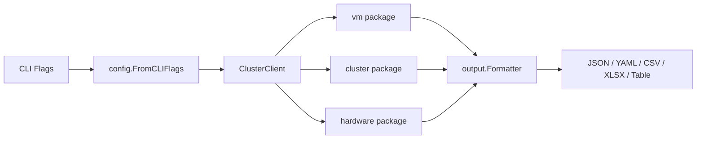
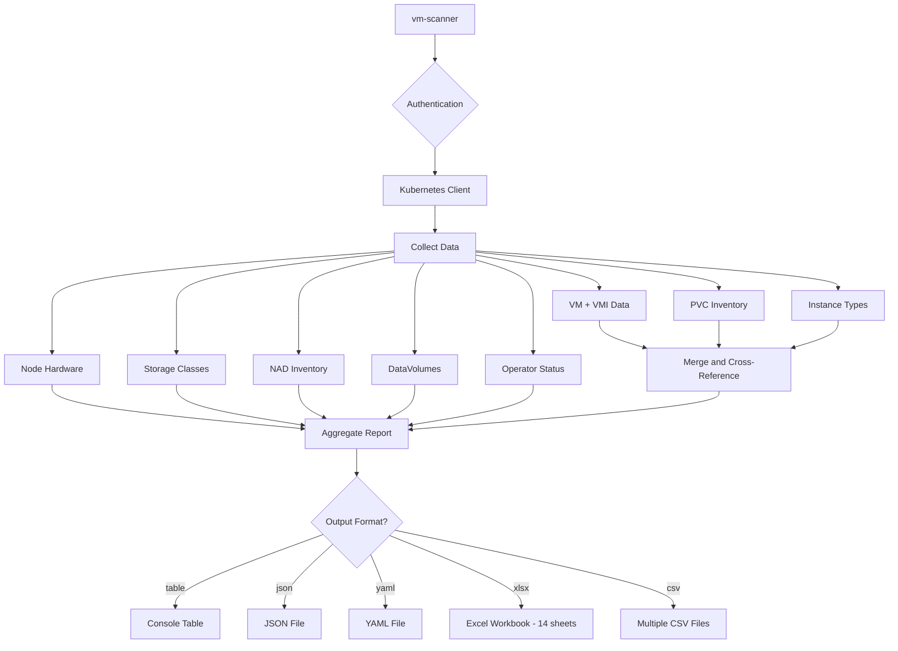

# Architecture

## Component Flow

## Data Collection Pipeline

When generating comprehensive reports, the scanner collects data from multiple sources and aggregates them into a unified format.

## API Endpoints Used

### Core Kubernetes APIs

- `k8s.io/api/core/v1` — Pod, Service, PersistentVolumeClaim, Event, Node, Namespace
- `k8s.io/api/apps/v1` — Deployment, ReplicaSet
- `k8s.io/api/storage/v1` — PersistentVolume, StorageClass
- `k8s.io/api/networking/v1` — NetworkPolicy, Ingress

### KubeVirt APIs

- `kubevirt.io/api/core/v1` — VirtualMachine, VirtualMachineInstance, DataVolume, VirtualMachineSnapshot
- `kubevirt.io/api/core/v1alpha3` — VirtualMachineInstanceReplicaSet

### Metrics APIs

- `metrics.k8s.io/v1beta1` — NodeMetrics, PodMetrics
- `custom.metrics.k8s.io/v1beta1` — Custom metrics

### Storage Metrics

**VM Storage Requested (Allocated)**
- **Source:** PVC `spec.resources.requests.storage`
- **API:** `/api/v1/namespaces/{ns}/persistentvolumeclaims/{name}`

**VM Storage Used (Actual Usage)**
- **Source:** KubeVirt Guest Agent (`qemu-guest-agent` must be running in the VM)
- **API:** `/apis/subresources.kubevirt.io/v1/namespaces/{ns}/virtualmachineinstances/{name}/guestosinfo`
- **Data:** `fsInfo.disks[].usedBytes` — aggregated across all filesystems

> Guest agent must be installed and running. Data is only available for running VMs.

## Dependencies

### Core

- `k8s.io/api v0.30.0` — Kubernetes API types
- `k8s.io/apimachinery v0.30.0` — Kubernetes API machinery
- `k8s.io/client-go v0.30.0` — Kubernetes client library
- `github.com/xuri/excelize/v2 v2.10.0` — Excel file generation
- `github.com/jedib0t/go-pretty/v6 v6.6.8` — Table formatting
- `gopkg.in/yaml.v2 v2.4.0` / `sigs.k8s.io/yaml v1.3.0` — YAML processing

### Build Requirements

- Go 1.24.0 or later
- Access to a Kubernetes cluster with KubeVirt/OpenShift Virtualization
- Valid kubeconfig or authentication credentials

## Related Documentation

- [Code Flow](CODEFLOW.md) — Detailed execution paths with mermaid diagrams tracing all major code paths from CLI through data collection, processing, and output generation
