# VM Scanner Code Flow

This document traces the execution paths through the vm-scanner codebase, from CLI invocation through to data collection, processing, and output generation.

## Table of Contents

1. [High-Level Architecture](#high-level-architecture)
2. [CLI Entry Point and Command Routing](#cli-entry-point-and-command-routing)
3. [Authentication and Client Initialization](#authentication-and-client-initialization)
4. [VM Data Collection Pipeline](#vm-data-collection-pipeline)
5. [Node Hardware Collection Pipeline](#node-hardware-collection-pipeline)
6. [Comprehensive Report Generation](#comprehensive-report-generation)
7. [Output Formatting Flow](#output-formatting-flow)
8. [Migration Readiness Assessment](#migration-readiness-assessment)
9. [Key Data Structures](#key-data-structures)

---

## High-Level Architecture

The vm-scanner follows a layered architecture from CLI flags through to output formatting.

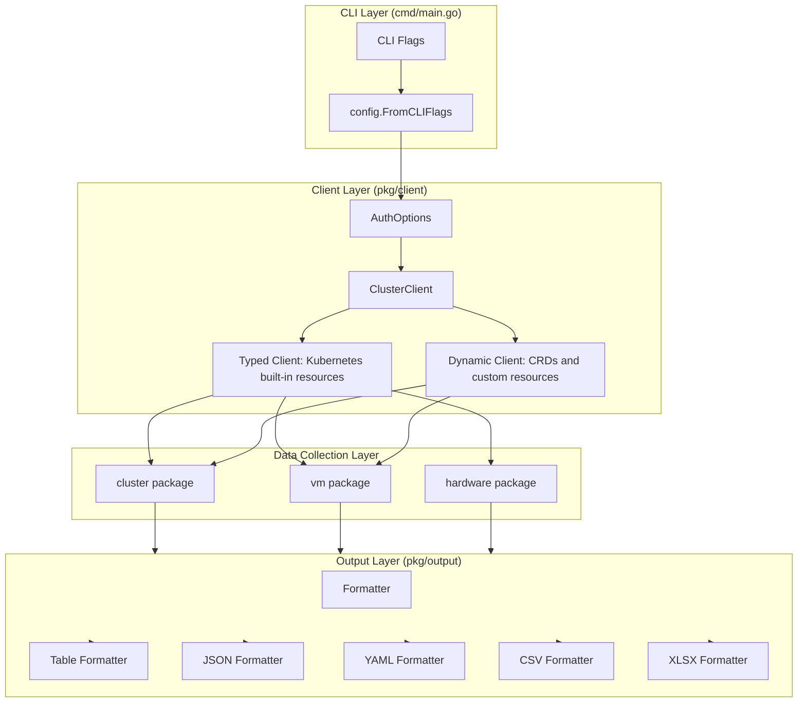
```mermaid
flowchart TB
    subgraph CLI["CLI Layer (cmd/main.go)"]
        FLAGS[CLI Flags]
        CONFIG[config.FromCLIFlags]
    end

    subgraph CLIENT["Client Layer (pkg/client)"]
        AUTH[AuthOptions]
        CLUSTER_CLIENT[ClusterClient]
        TYPED["Typed Client: Kubernetes built-in resources"]
        DYNAMIC["Dynamic Client: CRDs and custom resources"]
    end

    subgraph DATA[Data Collection Layer]
        VM_PKG[vm package]
        CLUSTER_PKG[cluster package]
        HARDWARE_PKG[hardware package]
    end

    subgraph OUTPUT["Output Layer (pkg/output)"]
        FORMATTER[Formatter]
        TABLE[Table Formatter]
        JSON[JSON Formatter]
        YAML[YAML Formatter]
        CSV[CSV Formatter]
        XLSX[XLSX Formatter]
    end

    FLAGS --> CONFIG
    CONFIG --> AUTH
    AUTH --> CLUSTER_CLIENT
    CLUSTER_CLIENT --> TYPED
    CLUSTER_CLIENT --> DYNAMIC
    TYPED --> VM_PKG
    TYPED --> CLUSTER_PKG
    TYPED --> HARDWARE_PKG
    DYNAMIC --> VM_PKG
    DYNAMIC --> CLUSTER_PKG
    CLUSTER_PKG --> OUTPUT
    VM_PKG --> OUTPUT
    HARDWARE_PKG --> OUTPUT
    OUTPUT --> TABLE
    OUTPUT --> JSON
    OUTPUT --> YAML
    OUTPUT --> CSV
    OUTPUT --> XLSX
```

**Key concept:** The project uses two Kubernetes client types:
- **Typed Client**: For built-in Kubernetes resources (Nodes, Pods, Namespaces, PVCs)
- **Dynamic Client**: For CRDs and custom resources (VirtualMachines, VirtualMachineInstances, KubeVirt resources)

---

## CLI Entry Point and Command Routing

When `vm-scanner` is invoked, `main.go` orchestrates configuration, client creation, and command execution.

### Entry Flow

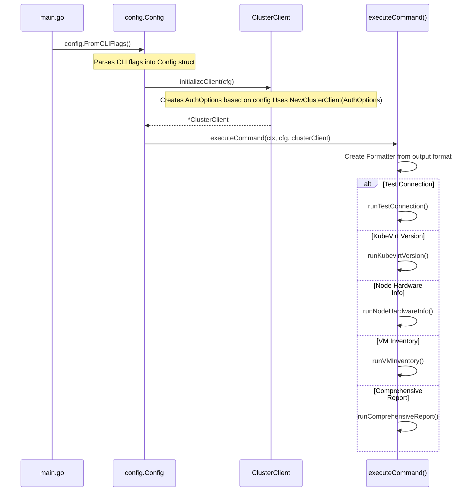
```mermaid
sequenceDiagram
    participant main as main.go
    participant config as config.Config
    participant client as ClusterClient
    participant executor as executeCommand()

    main->>config: config.FromCLIFlags()
    Note over config: Parses CLI flags into Config struct
    
    config->>client: initializeClient(cfg)
    Note over client: Creates AuthOptions based on config Uses NewClusterClient(AuthOptions)
    
    client-->>config: *ClusterClient
    
    config->>executor: executeCommand(ctx, cfg, clusterClient)
    executor->>executor: Create Formatter from output format
    
    alt Test Connection
        executor->>executor: runTestConnection()
    else KubeVirt Version
        executor->>executor: runKubevirtVersion()
    else Node Hardware Info
        executor->>executor: runNodeHardwareInfo()
    else VM Inventory
        executor->>executor: runVMInventory()
    else Comprehensive Report
        executor->>executor: runComprehensiveReport()
    end
```

### Command Switch Logic

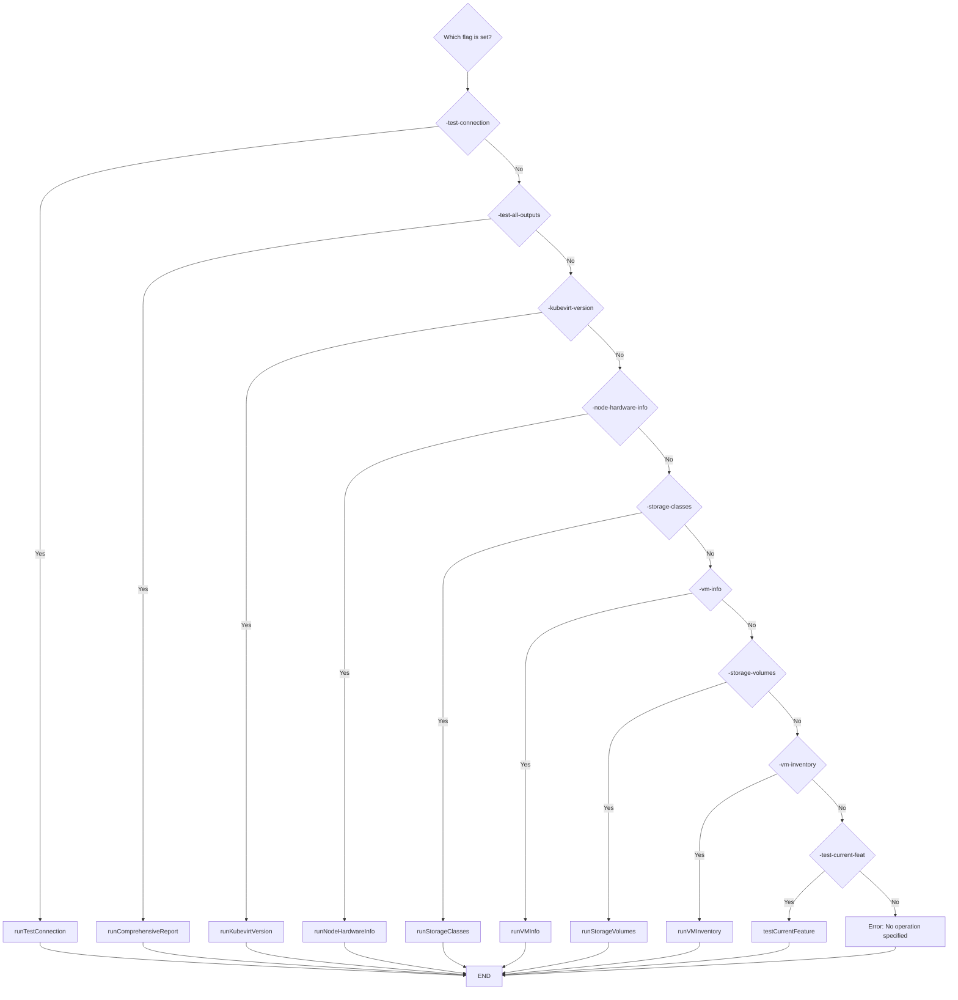
```mermaid
flowchart TD
    START{Which flag is set?} --> TESTCONN{-test-connection}
    TESTCONN -->|Yes| RUNCONN[runTestConnection]
    TESTCONN -->|No| TESTALL{-test-all-outputs}
    
    TESTALL -->|Yes| RUNALL[runComprehensiveReport]
    TESTALL -->|No| KV{-kubevirt-version}
    
    KV -->|Yes| RUNKV[runKubevirtVersion]
    KV -->|No| NH{-node-hardware-info}
    
    NH -->|Yes| RUNNH[runNodeHardwareInfo]
    NH -->|No| SC{-storage-classes}
    
    SC -->|Yes| RUNSC[runStorageClasses]
    SC -->|No| VI{-vm-info}
    
    VI -->|Yes| RUNVI[runVMInfo]
    VI -->|No| SV{-storage-volumes}
    
    SV -->|Yes| RUNSV[runStorageVolumes]
    SV -->|No| VMI{-vm-inventory}
    
    VMI -->|Yes| RUNVMI[runVMInventory]
    VMI -->|No| TCF{-test-current-feat}
    
    TCF -->|Yes| RUNTF[testCurrentFeature]
    TCF -->|No| ERR["Error: No operation specified"]
    
    RUNCONN --> END
    RUNALL --> END
    RUNKV --> END
    RUNNH --> END
    RUNSC --> END
    RUNVI --> END
    RUNSV --> END
    RUNVMI --> END
    RUNTF --> END
    ERR --> END
```

---

## Authentication and Client Initialization

The client initialization path supports multiple authentication methods.

### Auth Options Resolution

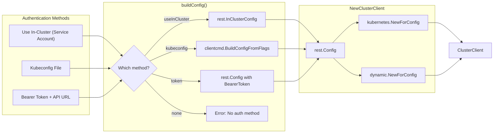
```mermaid
flowchart LR
    subgraph Auth_Methods[Authentication Methods]
        IC["Use In-Cluster (Service Account)"]
        KF[Kubeconfig File]
        BT[Bearer Token + API URL]
    end

    subgraph Build_Config["buildConfig()"]
        CHECK{Which method?}
        CHECK -->|useInCluster| INCLUSTER[rest.InClusterConfig]
        CHECK -->|kubeconfig| KUBECONFIG[clientcmd.BuildConfigFromFlags]
        CHECK -->|token| TOKEN[rest.Config with BearerToken]
        CHECK -->|none| FAIL["Error: No auth method"]
    end

    subgraph Client_Creation[NewClusterClient]
        CONFIG[rest.Config]
        CONFIG --> TYPED[kubernetes.NewForConfig]
        CONFIG --> DYN[dynamic.NewForConfig]
    end

    IC --> CHECK
    KF --> CHECK
    BT --> CHECK
    INCLUSTER --> CONFIG
    KUBECONFIG --> CONFIG
    TOKEN --> CONFIG
    TYPED --> ClusterClient
    DYN --> ClusterClient
```

### Client Test Connection Flow

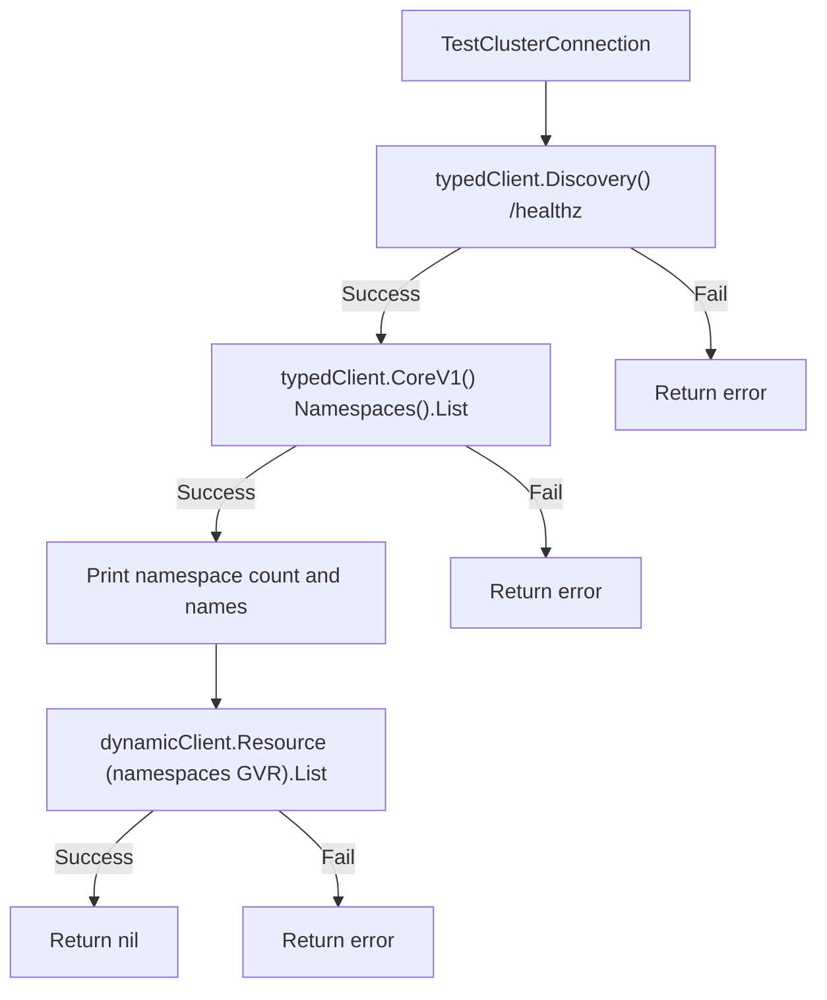
```mermaid
flowchart TD
    START[TestClusterConnection] --> TYPED_CHECK["typedClient.Discovery() /healthz"]
    TYPED_CHECK -->|Success| NAMESPACE_LIST["typedClient.CoreV1() Namespaces().List"]
    NAMESPACE_LIST -->|Success| PRINT_NS[Print namespace count and names]
    PRINT_NS --> DYN_CHECK["dynamicClient.Resource (namespaces GVR).List"]
    DYN_CHECK -->|Success| SUCCESS[Return nil]
    TYPED_CHECK -->|Fail| FAIL1[Return error]
    NAMESPACE_LIST -->|Fail| FAIL2[Return error]
    DYN_CHECK -->|Fail| FAIL3[Return error]
```

---

## VM Data Collection Pipeline

The VM collection process handles both running VMs (VMI) and stopped VMs (VM definitions).

### VM Inventory Build Flow (Running VMs)

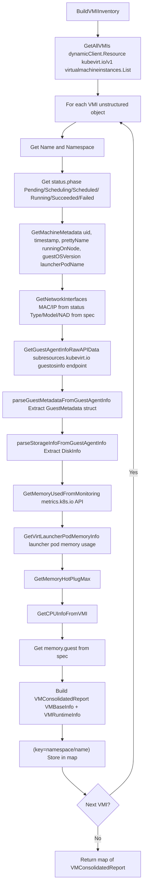
```mermaid
flowchart TD
    START[BuildVMIInventory] --> GET_ALL_VMIS[GetAllVMIs dynamicClient.Resource kubevirt.io/v1 virtualmachineinstances.List]
    
    GET_ALL_VMIS --> ITERATE[For each VMI unstructured object]
    ITERATE --> GET_NAME[Get Name and Namespace]
    GET_NAME --> GET_PHASE[Get status.phase Pending/Scheduling/Scheduled/ Running/Succeeded/Failed]
    
    GET_PHASE --> GET_META[GetMachineMetadata uid, timestamp, prettyName runningOnNode, guestOSVersion launcherPodName]
    
    GET_META --> GET_NET[GetNetworkInterfaces MAC/IP from status Type/Model/NAD from spec]
    
    GET_NET --> GET_GUEST[GetGuestAgentInfoRawAPIData subresources.kubevirt.io guestosinfo endpoint]
    
    GET_GUEST --> PARSE_GUEST[parseGuestMetadataFromGuestAgentInfo Extract GuestMetadata struct]
    PARSE_GUEST --> PARSE_DISK[parseStorageInfoFromGuestAgentInfo Extract DiskInfo]
    
    PARSE_DISK --> GET_MEM_METRICS[GetMemoryUsedFromMonitoring metrics.k8s.io API]
    GET_MEM_METRICS --> GET_LAUNCHER_MEM[GetVirtLauncherPodMemoryInfo launcher pod memory usage]
    
    GET_LAUNCHER_MEM --> GET_HOTPLUG[GetMemoryHotPlugMax]
    
    GET_HOTPLUG --> GET_CPU_INFO[GetCPUInfoFromVMI]
    GET_CPU_INFO --> GET_MEM_SPEC[Get memory.guest from spec]
    
    GET_MEM_SPEC --> BUILD_REPORT[Build VMConsolidatedReport VMBaseInfo + VMRuntimeInfo]
    BUILD_REPORT --> STORE["(key=namespace/name) Store in map"]
    
    STORE --> NEXT{Next VMI?}
    NEXT -->|Yes| ITERATE
    NEXT -->|No| RETURN[Return map of VMConsolidatedReport]
```

### Guest Agent Data Flow

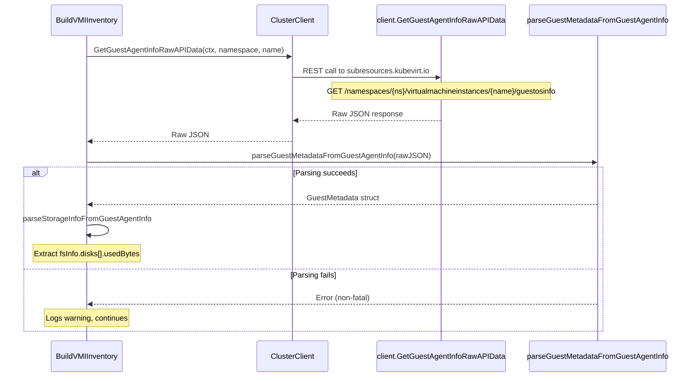
```mermaid
sequenceDiagram
    participant caller as BuildVMIInventory
    participant client as ClusterClient
    participant rawAPI as client.GetGuestAgentInfoRawAPIData
    participant parser as parseGuestMetadataFromGuestAgentInfo

    caller->>client: GetGuestAgentInfoRawAPIData(ctx, namespace, name)
    
    client->>rawAPI: REST call to subresources.kubevirt.io
    Note over rawAPI: GET /namespaces/{ns}/virtualmachineinstances/{name}/guestosinfo
    
    rawAPI-->>client: Raw JSON response
    client-->>caller: Raw JSON
    
    caller->>parser: parseGuestMetadataFromGuestAgentInfo(rawJSON)
    
    alt Parsing succeeds
        parser-->>caller: GuestMetadata struct
        caller->>caller: parseStorageInfoFromGuestAgentInfo
        Note over caller: Extract fsInfo.disks[].usedBytes
    else Parsing fails
        parser-->>caller: Error (non-fatal)
        Note over caller: Logs warning, continues
    end
```

### Stopped VM Handling (BuildVMBaseInfoFromVM)

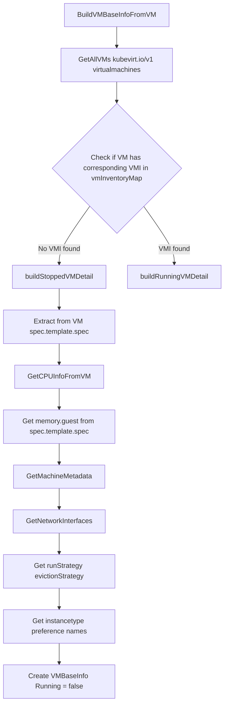
```mermaid
flowchart TD
    START[BuildVMBaseInfoFromVM] --> GET_VM[GetAllVMs kubevirt.io/v1 virtualmachines]
    
    GET_VM --> CHECK_RUNTIME{Check if VM has corresponding VMI in vmInventoryMap}
    
    CHECK_RUNTIME -->|No VMI found| BUILD_STOPPED[buildStoppedVMDetail]
    CHECK_RUNTIME -->|VMI found| BUILD_RUNNING[buildRunningVMDetail]
    
    BUILD_STOPPED --> EXTRACT_CONFIG[Extract from VM spec.template.spec]
    EXTRACT_CONFIG --> GET_CPU_VM[GetCPUInfoFromVM]
    GET_CPU_VM --> GET_MEM_VM[Get memory.guest from spec.template.spec]
    
    GET_MEM_VM --> GET_MACHINE_META[GetMachineMetadata]
    GET_MACHINE_META --> GET_NET_VM[GetNetworkInterfaces]
    
    GET_NET_VM --> GET_STRATEGY[Get runStrategy evictionStrategy]
    
    GET_STRATEGY --> GET_INSTANCETYPE[Get instancetype preference names]
    
    GET_INSTANCETYPE --> CREATE_BASEINFO[Create VMBaseInfo Running = false]
```

### VM vs VMI Distinction

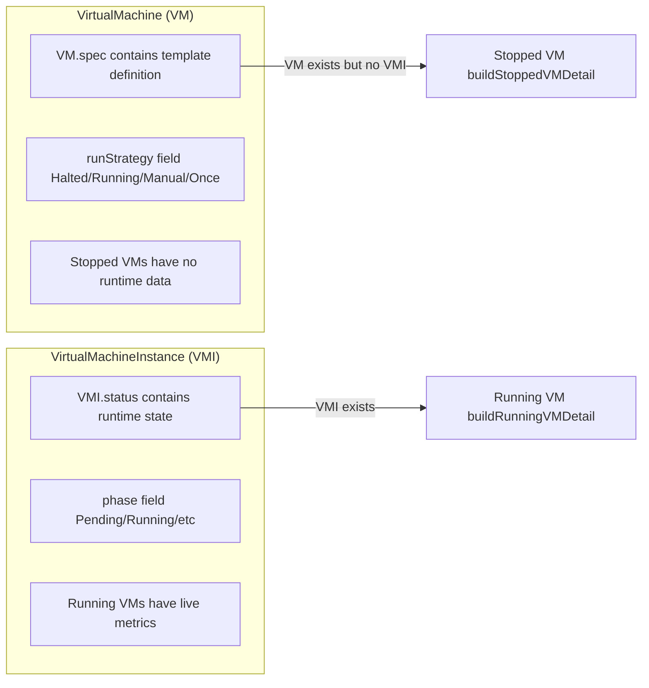
```mermaid
flowchart LR
    subgraph VirtualMachine["VirtualMachine (VM)"]
        VM_SPEC[VM.spec contains template definition]
        VM_RUNSTRAT[runStrategy field Halted/Running/Manual/Once]
        VM_STOPPED[Stopped VMs have no runtime data]
    end

    subgraph VirtualMachineInstance["VirtualMachineInstance (VMI)"]
        VMI_STATUS[VMI.status contains runtime state]
        VMI_PHASE[phase field Pending/Running/etc]
        VMI_RUNNING[Running VMs have live metrics]
    end

    VM_SPEC -->|VM exists but no VMI| STOPPED[Stopped VM buildStoppedVMDetail]
    VMI_STATUS -->|VMI exists| RUNNING[Running VM buildRunningVMDetail]
```

---

## Node Hardware Collection Pipeline

### Node Info Collection Flow

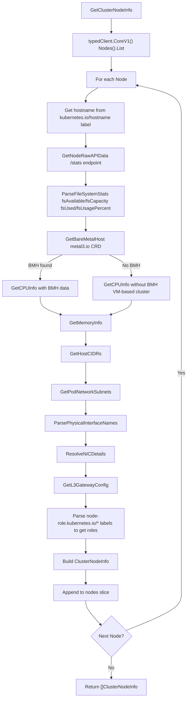
```mermaid
flowchart TD
    START[GetClusterNodeInfo] --> LIST_NODES["typedClient.CoreV1() Nodes().List"]
    
    LIST_NODES --> ITERATE_NODES[For each Node]
    ITERATE_NODES --> GET_HOSTNAME[Get hostname from kubernetes.io/hostname label]
    
    GET_HOSTNAME --> GET_RAW_STATS[GetNodeRawAPIData /stats endpoint]
    GET_RAW_STATS --> PARSE_FS[ParseFileSystemStats fsAvailable/fsCapacity fsUsed/fsUsagePercent]
    
    PARSE_FS --> GET_BMH[GetBareMetalHost metal3.io CRD]
    GET_BMH -->|BMH found| GET_CPU_BMH[GetCPUInfo with BMH data]
    GET_BMH -->|No BMH| GET_CPU_NODE[GetCPUInfo without BMH VM-based cluster]
    
    GET_CPU_BMH --> GET_MEM[GetMemoryInfo]
    GET_CPU_NODE --> GET_MEM
    
    GET_MEM --> GET_CIDRS[GetHostCIDRs]
    GET_CIDRS --> GET_POD_SUBNET[GetPodNetworkSubnets]
    
    GET_POD_SUBNET --> GET_PHYSICAL[ParsePhysicalInterfaceNames]
    GET_PHYSICAL --> RESOLVE_NIC[ResolveNICDetails]
    
    RESOLVE_NIC --> GET_L3[GetL3GatewayConfig]
    
    GET_L3 --> GET_ROLES[Parse node-role.kubernetes.io/* labels to get roles]
    
    GET_ROLES --> BUILD_NODEINFO[Build ClusterNodeInfo]
    BUILD_NODEINFO --> APPEND["Append to nodes slice"]
    
    APPEND --> NEXT_NODE{Next Node?}
    NEXT_NODE -->|Yes| ITERATE_NODES
    NEXT_NODE -->|No| RETURN["Return []ClusterNodeInfo"]
```

### Hardware Data Per Node

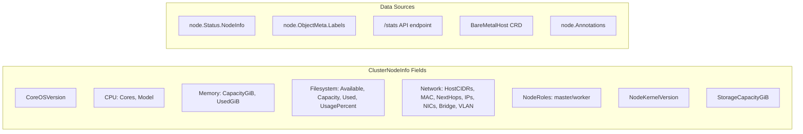
```mermaid
flowchart LR
    subgraph Node_Data["ClusterNodeInfo Fields"]
        COREOS[CoreOSVersion]
        CPU["CPU: Cores, Model"]
        MEM["Memory: CapacityGiB, UsedGiB"]
        FS["Filesystem: Available, Capacity, Used, UsagePercent"]
        NET["Network: HostCIDRs, MAC, NextHops, IPs, NICs, Bridge, VLAN"]
        ROLES["NodeRoles: master/worker"]
        KERNEL[NodeKernelVersion]
        STORAGE[StorageCapacityGiB]
    end

    subgraph Data_Sources[Data Sources]
        NODE_STATUS[node.Status.NodeInfo]
        NODE_LABELS[node.ObjectMeta.Labels]
        RAW_STATS["/stats API endpoint"]
        BMH[BareMetalHost CRD]
        NODE_ANN[node.Annotations]
    end
```

---

## Comprehensive Report Generation

The comprehensive report combines data from multiple sources into a unified structure.

### Report Generation Flow

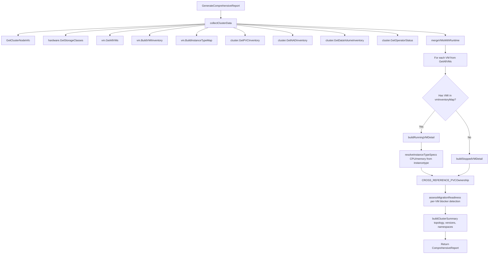
```mermaid
flowchart TD
    START[GenerateComprehensiveReport] --> COLLECT[collectClusterData]
    
    COLLECT --> GET_NODES[GetClusterNodeInfo]
    COLLECT --> GET_STORAGE[hardware.GetStorageClasses]
    COLLECT --> GET_ALL_VMS[vm.GetAllVMs]
    COLLECT --> GET_VMI_MAP[vm.BuildVMIInventory]
    COLLECT --> GET_IT[vm.BuildInstanceTypeMap]
    COLLECT --> GET_PVCS[cluster.GetPVCInventory]
    COLLECT --> GET_NADS[cluster.GetNADInventory]
    COLLECT --> GET_DVS[cluster.GetDataVolumeInventory]
    COLLECT --> GET_OPS[cluster.GetOperatorStatus]
    
    COLLECT --> MERGE[mergeVMsWithRuntime]
    MERGE --> FOR_EACH_VM[For each VM from GetAllVMs]
    
    FOR_EACH_VM --> CHECK_VMI{Has VMI in vmInventoryMap?}
    CHECK_VMI -->|Yes| BUILD_RUNNING[buildRunningVMDetail]
    CHECK_VMI -->|No| BUILD_STOPPED[buildStoppedVMDetail]
    
    BUILD_RUNNING --> RESOLVE_IT[resolveInstanceTypeSpecs CPU/memory from instancetype]
    RESOLVE_IT --> CROSS_REF[CROSS_REFERENCE_PVCOwnership]
    
    BUILD_STOPPED --> CROSS_REF
    
    CROSS_REF --> ASSESS[assessMigrationReadiness per-VM blocker detection]
    
    ASSESS --> BUILD_SUMMARY[buildClusterSummary topology, versions, namespaces]
    
    BUILD_SUMMARY --> RETURN[Return ComprehensiveReport]
```

### Data Collection Detail

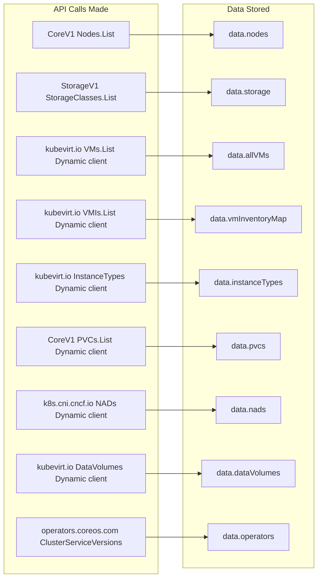
```mermaid
flowchart LR
    subgraph APIs["API Calls Made"]
        NODES[CoreV1 Nodes.List]
        STORAGE[StorageV1 StorageClasses.List]
        VMS[kubevirt.io VMs.List Dynamic client]
        VMI[kubevirt.io VMIs.List Dynamic client]
        INSTYPE[kubevirt.io InstanceTypes Dynamic client]
        PVCS[CoreV1 PVCs.List Dynamic client]
        NADS[k8s.cni.cncf.io NADs Dynamic client]
        DVS[kubevirt.io DataVolumes Dynamic client]
        OPS[operators.coreos.com ClusterServiceVersions]
    end

    subgraph Results[Data Stored]
        data_nodes[data.nodes]
        data_storage[data.storage]
        data_allVMs[data.allVMs]
        data_vmInventoryMap[data.vmInventoryMap]
        data_instanceTypes[data.instanceTypes]
        data_pvcs[data.pvcs]
        data_nads[data.nads]
        data_dataVolumes[data.dataVolumes]
        data_operators[data.operators]
    end

    NODES --> data_nodes
    STORAGE --> data_storage
    VMS --> data_allVMs
    VMI --> data_vmInventoryMap
    INSTYPE --> data_instanceTypes
    PVCS --> data_pvcs
    NADS --> data_nads
    DVS --> data_dataVolumes
    OPS --> data_operators
```

### ComprehensiveReport Structure

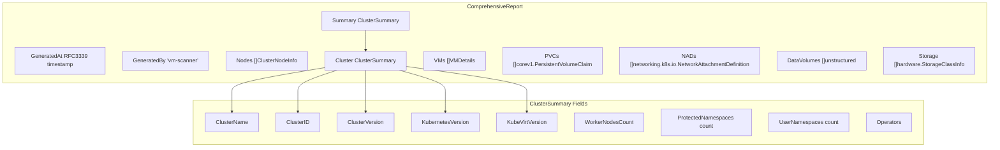
```mermaid
flowchart TB
    subgraph Report["ComprehensiveReport"]
        GENERATED_AT[GeneratedAt RFC3339 timestamp]
        GENERATED_BY["GeneratedBy 'vm-scanner'"]
        SUMMARY[Summary ClusterSummary]
        NODES["Nodes []ClusterNodeInfo"]
        CLUSTER[Cluster ClusterSummary]
        VMS["VMs []VMDetails"]
        PVCS["PVCs []corev1.PersistentVolumeClaim"]
        NADs["NADs []networking.k8s.io.NetworkAttachmentDefinition"]
        DATAVOL["DataVolumes []unstructured"]
        STORAGE["Storage []hardware.StorageClassInfo"]
    end

    subgraph ClusterSummary[ClusterSummary Fields]
        CL_NAME[ClusterName]
        CL_ID[ClusterID]
        CL_VERSION[ClusterVersion]
        CL_K8S_VERSION[KubernetesVersion]
        CL_KV_VERSION[KubeVirtVersion]
        CL_WORKERS[WorkerNodesCount]
        CL_PROTECTED[ProtectedNamespaces count]
        CL_USER[UserNamespaces count]
        CL_OPS[Operators]
    end

    SUMMARY --> CLUSTER
    CLUSTER --> CL_NAME
    CLUSTER --> CL_ID
    CLUSTER --> CL_VERSION
    CLUSTER --> CL_K8S_VERSION
    CLUSTER --> CL_KV_VERSION
```

---

## Output Formatting Flow

The Formatter class dispatches to format-specific handlers.

### Formatter Routing

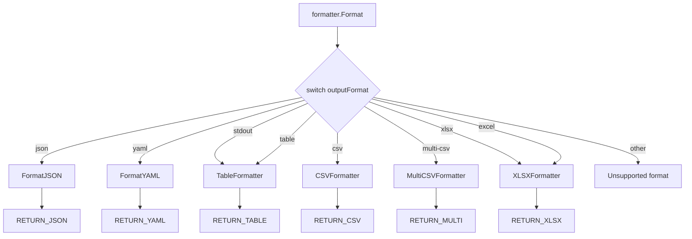
```mermaid
flowchart TD
    START[formatter.Format] --> SWITCH{switch outputFormat}
    
    SWITCH -->|json| JSON_FMT[FormatJSON]
    SWITCH -->|yaml| YAML_FMT[FormatYAML]
    SWITCH -->|stdout| TABLE_FMT[TableFormatter]
    SWITCH -->|table| TABLE_FMT
    SWITCH -->|csv| CSV_FMT[CSVFormatter]
    SWITCH -->|multi-csv| MULTI_CSV[MultiCSVFormatter]
    SWITCH -->|xlsx| XLSX_FMT[XLSXFormatter]
    SWITCH -->|excel| XLSX_FMT
    SWITCH -->|other| ERROR[Unsupported format]
    
    JSON_FMT --> RETURN_JSON
    YAML_FMT --> RETURN_YAML
    TABLE_FMT --> RETURN_TABLE
    CSV_FMT --> RETURN_CSV
    MULTI_CSV --> RETURN_MULTI
    XLSX_FMT --> RETURN_XLSX
```

### XLSX Workbook Structure

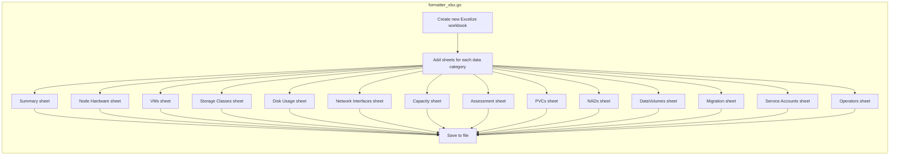
```mermaid
flowchart LR
    subgraph XLSX_Generator[formatter_xlsx.go]
        NEW_XLSX[Create new Excelize workbook]
        ADD_SHEETS[Add sheets for each data category]
        SUM[Summary sheet]
        NH[Node Hardware sheet]
        VM[VMs sheet]
        SC[Storage Classes sheet]
        DISK[Disk Usage sheet]
        NET[Network Interfaces sheet]
        CAP[Capacity sheet]
        ASSESS[Assessment sheet]
        PVC[PVCs sheet]
        NAD[NADs sheet]
        DV[DataVolumes sheet]
        MIG[Migration sheet]
        SA[Service Accounts sheet]
        OPS[Operators sheet]
        SAVE[Save to file]
    end

    NEW_XLSX --> ADD_SHEETS
    ADD_SHEETS --> SUM
    ADD_SHEETS --> NH
    ADD_SHEETS --> VM
    ADD_SHEETS --> SC
    ADD_SHEETS --> DISK
    ADD_SHEETS --> NET
    ADD_SHEETS --> CAP
    ADD_SHEETS --> ASSESS
    ADD_SHEETS --> PVC
    ADD_SHEETS --> NAD
    ADD_SHEETS --> DV
    ADD_SHEETS --> MIG
    ADD_SHEETS --> SA
    ADD_SHEETS --> OPS
    SUM --> SAVE
    NH --> SAVE
    VM --> SAVE
    SC --> SAVE
    DISK --> SAVE
    NET --> SAVE
    CAP --> SAVE
    ASSESS --> SAVE
    PVC --> SAVE
    NAD --> SAVE
    DV --> SAVE
    MIG --> SAVE
    SA --> SAVE
    OPS --> SAVE
```

### Multi-CSV Output Structure

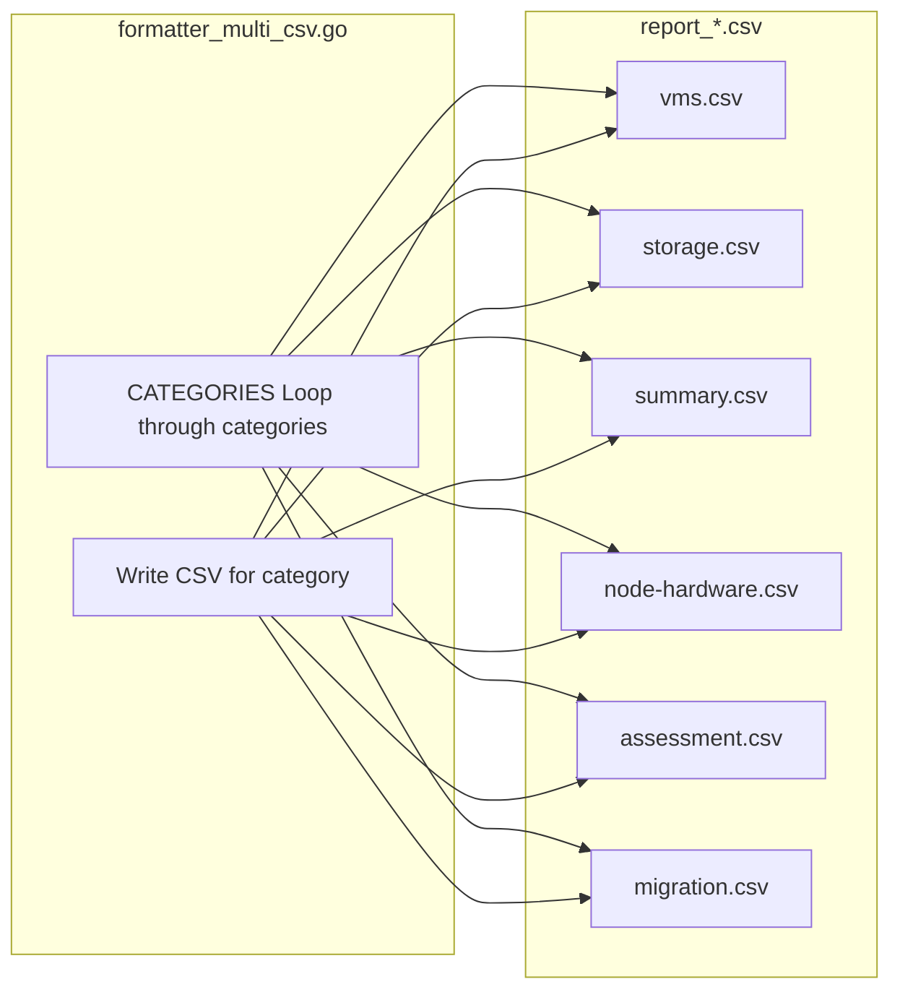
```mermaid
flowchart LR
    subgraph Output_Files["report_*.csv"]
        VMS[vms.csv]
        STORAGE[storage.csv]
        SUMMARY[summary.csv]
        NODE_HW[node-hardware.csv]
        ASSESS[assessment.csv]
        MIG[migration.csv]
    end

    subgraph CSV_Generator["formatter_multi_csv.go"]
        SWITCH_CSV[CATEGORIES Loop through categories]
        WRITE[Write CSV for category]
    end

    SWITCH_CSV --> VMS
    SWITCH_CSV --> STORAGE
    SWITCH_CSV --> SUMMARY
    SWITCH_CSV --> NODE_HW
    SWITCH_CSV --> ASSESS
    SWITCH_CSV --> MIG
    WRITE --> VMS
    WRITE --> STORAGE
    WRITE --> SUMMARY
    WRITE --> NODE_HW
    WRITE --> ASSESS
    WRITE --> MIG
```

---

## Migration Readiness Assessment

Each VM is assessed for live migration compatibility.

### Migration Assessment Flow

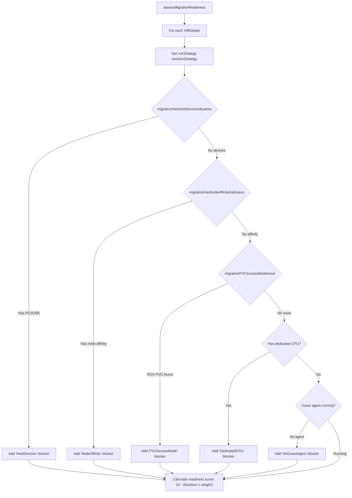
```mermaid
flowchart TD
    START[assessMigrationReadiness] --> FOR_EACH_VM[For each VMDetails]

    FOR_EACH_VM --> GET_STRATEGY[Get runStrategy evictionStrategy]
    
    GET_STRATEGY --> CHECK_DEVICES{migrationHasHostDeviceIndicators}
    
    CHECK_DEVICES -->|Has PCI/USB| ADD_BLOCKER["Add 'HostDevices' blocker"]
    CHECK_DEVICES -->|No devices| CHECK_AFFINITY{migrationHasNodeAffinityIndicators}
    
    CHECK_AFFINITY -->|Has node affinity| ADD_BLOCKER2["Add 'NodeAffinity' blocker"]
    CHECK_AFFINITY -->|No affinity| CHECK_PVC{migrationPVCAccessModeIssue}
    
    CHECK_PVC -->|ROX PVC found| ADD_BLOCKER3["Add 'PVCAccessMode' blocker"]
    CHECK_PVC -->|No issue| CHECK_DEDICATED{Has dedicated CPU?}
    
    CHECK_DEDICATED -->|Yes| ADD_BLOCKER4["Add 'DedicatedCPU' blocker"]
    CHECK_DEDICATED -->|No| CHECK_AGENT{Guest agent running?}
    
    CHECK_AGENT -->|No agent| ADD_BLOCKER5["Add 'NoGuestAgent' blocker"]
    CHECK_AGENT -->|Running| CALC_SCORE["Calculate readiness score: 10 - (blockers x weight)"]
    
    ADD_BLOCKER --> CALC_SCORE
    ADD_BLOCKER2 --> CALC_SCORE
    ADD_BLOCKER3 --> CALC_SCORE
    ADD_BLOCKER4 --> CALC_SCORE
    ADD_BLOCKER5 --> CALC_SCORE
```

### Blocker Detection Details

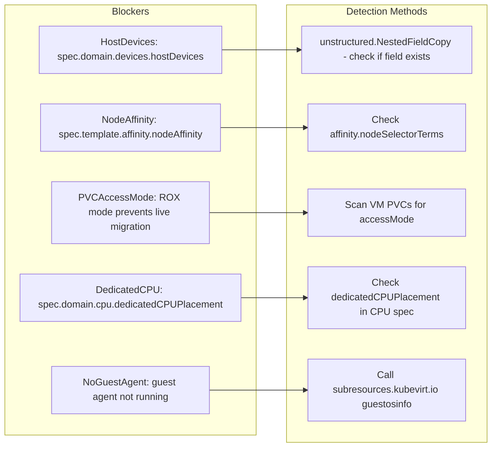
```mermaid
flowchart LR
    subgraph Blockers[Blockers]
        HDI["HostDevices: spec.domain.devices.hostDevices"]
        NAI["NodeAffinity: spec.template.affinity.nodeAffinity"]
        PCA["PVCAccessMode: ROX mode prevents live migration"]
        DED["DedicatedCPU: spec.domain.cpu.dedicatedCPUPlacement"]
        NGA["NoGuestAgent: guest agent not running"]
    end

    subgraph Detection_Methods[Detection Methods]
        UNSTR["unstructured.NestedFieldCopy - check if field exists"]
        AF_FIELD["Check affinity.nodeSelectorTerms"]
        PVC_SCAN["Scan VM PVCs for accessMode"]
        CPU_DED["Check dedicatedCPUPlacement in CPU spec"]
        GUEST_API["Call subresources.kubevirt.io guestosinfo"]
    end

    HDI --> UNSTR
    NAI --> AF_FIELD
    PCA --> PVC_SCAN
    DED --> CPU_DED
    NGA --> GUEST_API
```

---

## Key Data Structures

### VM Data Hierarchy

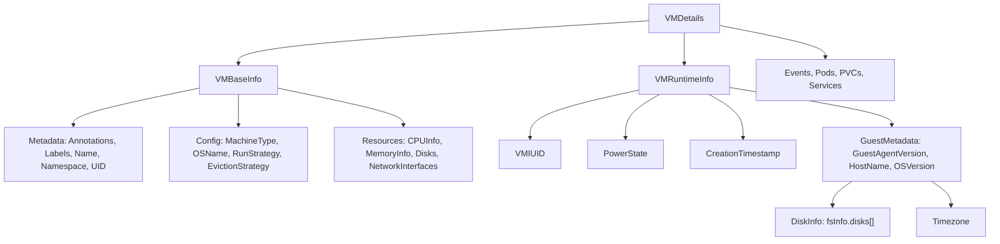
```mermaid
flowchart TB
    VMD["VMDetails"] --> VMB["VMBaseInfo"]
    VMD --> VMR["VMRuntimeInfo"]
    VMD --> OTH["Events, Pods, PVCs, Services"]

    VMB --> META["Metadata: Annotations, Labels, Name, Namespace, UID"]
    VMB --> CFG["Config: MachineType, OSName, RunStrategy, EvictionStrategy"]
    VMB --> RES["Resources: CPUInfo, MemoryInfo, Disks, NetworkInterfaces"]

    VMR --> VMIUID[VMIUID]
    VMR --> PowerState[PowerState]
    VMR --> CreationTimestamp[CreationTimestamp]
    VMR --> GM["GuestMetadata: GuestAgentVersion, HostName, OSVersion"]

    GM --> DI["DiskInfo: fsInfo.disks[]"]
    GM --> TZ[Timezone]
```

### Client Structure

```mermaid
flowchart LR
    subgraph ClusterClient["ClusterClient"]
        TYPED[kubernetes.Interface Built-in K8s resources]
        DYNAMIC[dynamic.Interface CRDs and custom resources]
        CONFIG[*rest.Config Connection config]
    end

    subgraph API_Coverage[API Coverage]
        CORE["CoreV1: Nodes, Pods, Namespaces, PVCs"]
        APPS["AppsV1: Deployments"]
        STORAGE["StorageV1: StorageClasses"]
        NET["NetworkingV1: NADs"]
        KV["kubevirt.io: VMs, VMIs, KubeVirt, DataVolumes"]
        OPS["operators.coreos.com: ClusterServiceVersions"]
    end

    ClusterClient --> TYPED
    ClusterClient --> DYNAMIC
    TYPED --> CORE
    TYPED --> APPS
    TYPED --> STORAGE
    TYPED --> NET
    DYNAMIC --> KV
    DYNAMIC --> OPS
```

### Storage Class Data Flow

```mermaid
flowchart LR
    subgraph Input["hardware.GetStorageClasses"]
        TYPED["typedClient CoreV1().StorageClasses()"]
    end

    subgraph Processing[For each StorageClass]
        PARSE_SC["Extract: provisioner, reclaimPolicy, bindingMode, parameters, mountOptions"]
        CHECK_DEFAULT[Check if default via storageclass.beta.kubernetes.io/ storage.k8s.io/is-default-class]
        CHECK_ALLOW_EXPAND[Check allowVolumeExpansion]
        GET_TOPOLOGIES[Parse allowedTopologies]
    end

    subgraph Output[StorageClassInfo]
        NAME[Name]
        PROVISIONER[Provisioner]
        RECLAIM[ReclaimPolicy]
        BINDING[VolumeBindingMode]
        DEFAULT[IsDefault]
        ALLOW_EXP[AllowVolumeExpansion]
        PARAMS[Parameters map]
        MOUNT[MountOptions]
        TOPOLOGIES[AllowedTopologies]
    end

    TYPED --> PARSE_SC
    PARSE_SC --> CHECK_DEFAULT
    CHECK_DEFAULT --> CHECK_ALLOW_EXPAND
    CHECK_ALLOW_EXPAND --> GET_TOPOLOGIES
    GET_TOPOLOGIES --> Output
```

---

## Error Handling Strategy

The project uses centralized error handling with non-fatal warnings for optional data.

### Error Handling Flow

```mermaid
flowchart TD
    START[Data collection operation] --> TRY[Attempt operation]
    
    TRY -->|Success| CONTINUE[Continue processing]
    TRY -->|Error| CHECK_FATAL{Is error fatal?}

    CHECK_FATAL -->|Required data| LOG_FAIL[Log error and return]
    CHECK_FATAL -->|Optional data| LOG_WARN[Log warning Use zero value Continue]

    LOG_FAIL --> RETURN_ERROR[Return error to caller]
    LOG_WARN --> CONTINUE

    CONTINUE --> NEXT[Next item in loop]
    NEXT --> START
    
    subgraph Examples["Error Handling Examples"]
        REQ["Required: Cluster connection, VM list retrieval"]
        OPT["Optional: Guest agent data, Bare metal host info, Metrics data"]
    end

    REQ --> CHECK_FATAL
    OPT --> CHECK_FATAL
```

---

## CLI Flags to Functions Mapping

```mermaid
flowchart LR
    subgraph Flags["CLI Flags"]
        TESTCONN[-test-connection]
        KV[-kubevirt-version]
        NH[-node-hardware-info]
        SC[-storage-classes]
        VI[-vm-info]
        SV[-storage-volumes]
        VMI[-vm-inventory]
        ALL[-test-all-outputs]
    end

    subgraph Functions["Handler Functions"]
        RUNCONN[runTestConnection]
        RUNKV[runKubevirtVersion]
        RUNNH[runNodeHardwareInfo]
        RUNSC[runStorageClasses]
        RUNVI[runVMInfo]
        RUNSV[runStorageVolumes]
        RUNVMI[runVMInventory]
        RUNALL[runComprehensiveReport]
    end

    subgraph Data_Sources["Data Sources"]
        CLIENT_TEST[TestConnection]
        KV_GET[cluster.GetKubeVirtVersion]
        NH_GET[cluster.GetClusterNodeInfo]
        SC_GET[hardware.GetStorageClasses]
        VI_GET[vm.GetAllVMIs]
        SV_GET[GenerateStorageVolumesReport]
        VMI_GET[vm.BuildVMIInventory]
        ALL_GET[GenerateComprehensiveReport]
    end

    TESTCONN --> RUNCONN
    KV --> RUNKV
    NH --> RUNNH
    SC --> RUNSC
    VI --> RUNVI
    SV --> RUNSV
    VMI --> RUNVMI
    ALL --> RUNALL

    RUNCONN --> CLIENT_TEST
    RUNKV --> KV_GET
    RUNNH --> NH_GET
    RUNSC --> SC_GET
    RUNVI --> VI_GET
    RUNSV --> SV_GET
    RUNVMI --> VMI_GET
    RUNALL --> ALL_GET
```

---

## Memory and CPU Hotplug Flow

### Memory Hotplug Detection

```mermaid
flowchart TD
    START[GetMemoryHotPlugMax] --> GET_LIMIT[Get spec.domain.memory hotplugMax]
    
    GET_LIMIT -->|Exists| RETURN_MAX[Return hotplugMax as float64 MiB]
    GET_LIMIT -->|Not exists| RETURN_ZERO[Return 0 No hotplug support]

    subgraph Usage["Memory usage comes from"]
        METRICS[metrics.k8s.io v1beta1.NodeMetrics]
        GUEST_AGENT[KubeVirt guest agent guestosinfo API]
        VMI_STATUS[VMI status.memory]
    end

    METRICS --> MEM_USED[MemoryUsedByVMI]
    GUEST_AGENT --> MEM_USED
    VMI_STATUS --> MEM_USED
```

---

## Instance Type Resolution

Instance types provide pre-defined CPU/memory specifications that VMs can reference.

### Instance Type Lookup Flow

```mermaid
flowchart TD
    START[resolveInstanceTypeSpecs] --> BUILD_MAP[BuildInstanceTypeMap Get all instancetypes]
    
    BUILD_MAP --> GET_KINDS[Get both VirtualMachineClusterInstancetype and VirtualMachineInstancetype]
    
    GET_KINDS --> STORE_MAP["Store in map by name: namespace/name to specs"]
    
    STORE_MAP --> FOR_EACH_VM[For each VMDetails]
    
    FOR_EACH_VM --> HAS_IT{VM has spec.instancetype.name?}
    
    HAS_IT -->|Yes| LOOKUP[Lookup instancetype in map]
    
    LOOKUP -->|Found| ENRICH[Enrich VM CPU/memory from instancetype]
    
    LOOKUP -->|Not found| SKIP[Skip - use VM spec values]
    
    HAS_IT -->|No| SKIP
    ENRICH --> NEXT_VM
    SKIP --> NEXT_VM
    NEXT_VM -->|Yes| FOR_EACH_VM
    NEXT_VM -->|No| RETURN[Return enriched VMs]
```

---

## Network Interface Data Collection

### Network Info Extraction Flow

```mermaid
flowchart LR
    subgraph Sources["Network Data Sources"]
        VMI_SPEC[spec.domain.devices.interfaces]
        VMI_STATUS[status.interfaces]
        NAD[NetworkAttachmentDefinition]
    end

    subgraph Extraction["GetVMNetworkInterfaces"]
        INTERFACES[Loop interfaces]
        GET_MAC["Get MAC from status.iface[index].macAddress"]
        GET_IPS["Get IPs from status.iface[index].IPs"]
        GET_MODEL["Get model from spec.interfaces[index].model"]
        GET_TYPE["Get type from spec.interfaces[index].type"]
        GET_NET["Get network from spec.interfaces[index].network.name"]
        RESOLVE_NAD[Resolve NAD name to full NAD]
    end

    subgraph Output["VMNetworkInfo"]
        MAC[MACAddress]
        IPS[IPAddresses]
        MODEL[Model]
        TYPE[Type]
        NAME[Name]
        NETWORK[Network]
        NAD_NAME[NetworkAttachmentDefinition]
    end

    VMI_SPEC --> Extraction
    VMI_STATUS --> Extraction
    NAD --> RESOLVE_NAD
    Extraction --> Output
```

---

## PVC Ownership Cross-Reference

```mermaid
flowchart TD
    START[crossReferencePVCOwnership] --> GET_ALL_PVCS[GetPVCInventory All PVCs in cluster]

    GET_ALL_PVCS --> FOR_EACH_PVC[For each PVC]

    FOR_EACH_PVC --> GET_OWNER[Check metadata.ownerReferences]

    GET_OWNER -->|Has owner| MATCH_VM{Is owner a VM?}
    GET_OWNER -->|No owner| MARK_ORPHAN[Mark as Orphaned]

    MATCH_VM -->|Yes| SET_VM_REF[Set VM reference in PVC data]
    MATCH_VM -->|No| MARK_ORPHAN

    SET_VM_REF --> NEXT_PVC
    MARK_ORPHAN --> NEXT_PVC

    NEXT_PVC -->|Yes| FOR_EACH_PVC
    NEXT_PVC -->|No| RETURN[Return enriched PVCs]
```

---

## File Locations Summary

| Component | File | Key Functions |
|-----------|------|---------------|
| CLI Entry | `cmd/main.go` | `main()`, `executeCommand()` |
| Config | `pkg/config/config.go` | `FromCLIFlags()` |
| Client | `pkg/client/client.go` | `NewClusterClient()`, `TestConnection()` |
| VM Operations | `pkg/vm/vm.go` | `GetAllVMIs()`, `BuildVMIInventory()` |
| VM Types | `pkg/vm/types.go` | `VMDetails`, `VMBaseInfo`, `VMRuntimeInfo` |
| Cluster Info | `pkg/cluster/cluster.go` | `GetKubeVirtVersion()`, `GetClusterNodeInfo()` |
| Hardware | `pkg/hardware/` | `GetCPUInfo()`, `GetMemoryInfo()`, `GetStorageClasses()` |
| Output | `pkg/output/formatter.go` | `Format()`, `FormatXLSX()`, `FormatMultiCSV()` |
| Report Gen | `pkg/output/report_generator.go` | `GenerateComprehensiveReport()`, `assessMigrationReadiness()` |

---

## Related Documentation

- [Architecture Overview](ARCHITECTURE.md) - Component relationships and API endpoints
- [Usage Guide](USAGE.md) - CLI flags and output format details
- [Project Layout](PROJECT_LAYOUT.md) - Directory structure and file purposes