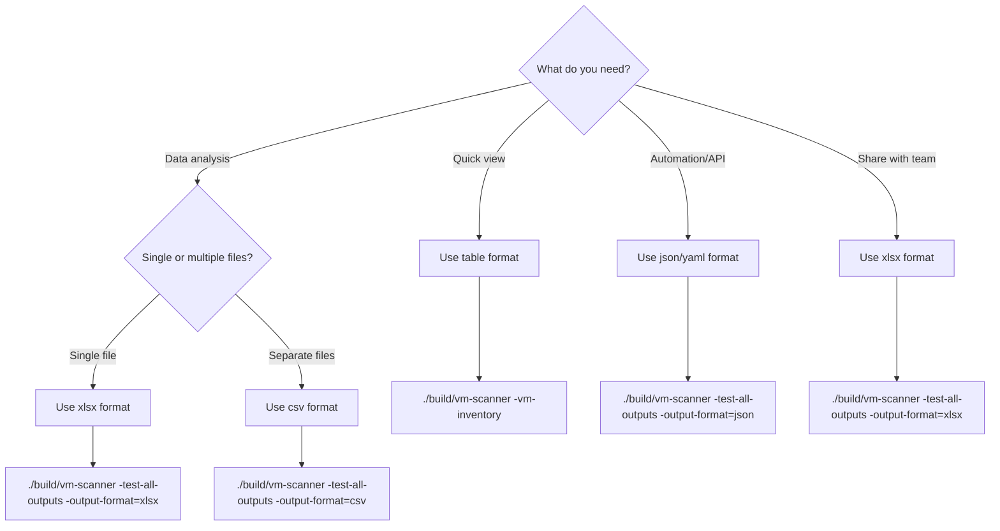

# Usage Guide

## Authentication

VM Scanner supports three authentication methods:

```bash
# Default — uses ~/.kube/config or KUBECONFIG env var
./build/vm-scanner -test-connection

# Explicit kubeconfig path
./build/vm-scanner -test-connection -kube-config=/path/to/kubeconfig

# Bearer token + API URL
./build/vm-scanner -test-connection -token=<token> -api-url=https://api.cluster.example.com:6443

# In-cluster (for pod deployments)
./build/vm-scanner -auth-method=in-cluster -test-connection
```

## Connection Testing

```bash
./build/vm-scanner -test-connection
```

Example output:

```
✅ Connection test SUCCESSFUL
   Cluster is reachable
   KubeVirt Version: v1.3.1
   Status: Deployed
```

## Information Gathering

```bash
# Get KubeVirt version and status
./build/vm-scanner -kubevirt-version

# Get node hardware information
./build/vm-scanner -node-hardware-info

# Get storage classes
./build/vm-scanner -storage-classes

# Get VM information (VMI list)
./build/vm-scanner -vm-info

# Get VM inventory (consolidated view with runtime data)
./build/vm-scanner -vm-inventory

# Get storage volumes for all VMs
./build/vm-scanner -storage-volumes
```

## Comprehensive Reports

```bash
# Generate full Excel report with all data
./build/vm-scanner -test-all-outputs -output-format=xlsx -output-file=report.xlsx

# Generate multiple CSV files (one per category)
./build/vm-scanner -test-all-outputs -output-format=csv -output-file=report

# Generate JSON report
./build/vm-scanner -test-all-outputs -output-format=json -output-file=report.json

# Generate YAML report
./build/vm-scanner -test-all-outputs -output-format=yaml -output-file=report.yaml
```

## Output to Different Formats

```bash
# Table output to console (default)
./build/vm-scanner -vm-inventory

# JSON output to file
./build/vm-scanner -vm-inventory -output-format=json -output-file=vms.json

# YAML output
./build/vm-scanner -node-hardware-info -output-format=yaml
```

## CLI Reference

| Flag | Description |
|---|---|
| `-test-connection` | Test cluster connectivity and print KubeVirt version |
| `-vm-inventory` | VM inventory — consolidated view with runtime data |
| `-vm-info` | VMI list with phase and node placement |
| `-node-hardware-info` | Node CPU, memory, filesystem, and network details |
| `-kubevirt-version` | KubeVirt/OpenShift Virtualization version and status |
| `-storage-classes` | List storage classes with provisioner details |
| `-storage-volumes` | List storage volumes for all VMs |
| `-test-all-outputs` | Generate comprehensive multi-sheet report |
| `-kube-config` | Path to kubeconfig file |
| `-token` | Bearer token for authentication |
| `-api-url` | Cluster API URL (used with `-token`) |
| `-auth-method` | `kubeconfig` (default) or `in-cluster` |
| `-output-format` | `table` / `json` / `yaml` / `csv` / `xlsx` |
| `-output-file` | Output file path |

## Output Formats

### Table (stdout)

Human-readable console tables. Ideal for quick inspections and terminal workflows.

```bash
./build/vm-scanner -vm-inventory
```

**Use when:** Quick manual inspection, terminal environments, no file output needed.

### JSON

Single JSON file containing all collected data in a structured format.

```bash
./build/vm-scanner -test-all-outputs -output-format=json -output-file=report.json
```

**Use when:** Automation tools, programmatic processing, API consumption.

### YAML

YAML formatted output, similar to JSON but more human-readable.

```bash
./build/vm-scanner -node-hardware-info -output-format=yaml -output-file=nodes.yaml
```

**Use when:** Human-readable structured data, Kubernetes manifest workflows.

### CSV

Multiple CSV files, one per data category.

```bash
./build/vm-scanner -test-all-outputs -output-format=csv -output-file=report
# Creates: report_vms.csv, report_storage.csv, report_summary.csv, report_node-hardware.csv
```

**Use when:** Database import, script processing, per-category file separation.

### Excel (XLSX)

Excel workbook with 14 sheets organized by data type (see [sheet listing below](#comprehensive-excel-report-sheets)).

```bash
./build/vm-scanner -test-all-outputs -output-format=xlsx -output-file=report.xlsx
```

**Use when:** Sharing with stakeholders, data analysis in Excel/LibreOffice, RVTools-like output.

### Choosing an Output Format



## Example Output

### VM Inventory (Table)

```
=== VM RUNTIME INVENTORY ===
Total Running VMs: 5

┌──────────────────────┬────────────────┬─────────────┬──────────────────────────┬───────────────────────┬──────────────┐
│ NAME                 │ NAMESPACE      │ POWER STATE │ NODE                     │ OS                    │ MEMORY USED  │
├──────────────────────┼────────────────┼─────────────┼──────────────────────────┼───────────────────────┼──────────────┤
│ rhel9-web-server     │ production     │ Running     │ worker-01.example.com    │ Red Hat Enterprise 9  │ 1024.0 MiB   │
│ centos-stream-db     │ production     │ Running     │ worker-02.example.com    │ CentOS Stream 9       │ 2048.0 MiB   │
│ fedora-dev-box       │ development    │ Running     │ worker-01.example.com    │ Fedora 39             │ 512.0 MiB    │
│ win2022-legacy-app   │ legacy         │ Stopped     │ N/A                      │ Microsoft Windows     │ N/A          │
│ ubuntu-test          │ testing        │ Running     │ worker-03.example.com    │ Ubuntu 22.04          │ 768.0 MiB    │
└──────────────────────┴────────────────┴─────────────┴──────────────────────────┴───────────────────────┴──────────────┘
```

### VMI List (Table)

```
=== VIRTUAL MACHINE INSTANCES ===
Total VM Instances: 4

┌──────────────────────┬────────────────┬─────────┬──────────────────────────┐
│ NAME                 │ NAMESPACE      │ PHASE   │ NODE                     │
├──────────────────────┼────────────────┼─────────┼──────────────────────────┤
│ rhel9-web-server     │ production     │ Running │ worker-01.example.com    │
│ centos-stream-db     │ production     │ Running │ worker-02.example.com    │
│ fedora-dev-box       │ development    │ Running │ worker-01.example.com    │
│ ubuntu-test          │ testing        │ Running │ worker-03.example.com    │
└──────────────────────┴────────────────┴─────────┴──────────────────────────┘
```

### KubeVirt Version (Table)

```
=== KUBEVIRT VERSION ===

┌──────────┬─────────────┐
│ PROPERTY │ VALUE       │
├──────────┼─────────────┤
│ Version  │ v1.3.1      │
│ Status   │ Deployed    │
└──────────┴─────────────┘
```

### Storage Volumes (Table)

```
=== STORAGE VOLUMES ===
Total VMs: 3
Total Volumes: 5

┌───────────────────────────┬────────┬──────────────────────────┬──────────────────┬───────────────┐
│ VOLUME NAME               │ SIZE   │ STORAGE CLASS            │ TYPE             │ TOTAL STORAGE │
├───────────────────────────┼────────┼──────────────────────────┼──────────────────┼───────────────┤
│ rhel9-web-server-root     │ 30 GiB │ ocs-storagecluster-ceph  │ pvc              │ 30 GiB        │
│ centos-stream-db-root     │ 50 GiB │ ocs-storagecluster-ceph  │ pvc              │ 50 GiB        │
│ centos-stream-db-data     │ 100 GiB│ ocs-storagecluster-ceph  │ pvc              │ 100 GiB       │
│ fedora-dev-box-root       │ 20 GiB │ ocs-storagecluster-ceph  │ dataVolumeTemplate│ 20 GiB       │
│ ubuntu-test-root          │ 25 GiB │ ocs-storagecluster-ceph  │ pvc              │ 25 GiB        │
└───────────────────────────┴────────┴──────────────────────────┴──────────────────┴───────────────┘
```

### Comprehensive Excel Report Sheets

When using `-test-all-outputs -output-format=xlsx`, the workbook contains these sheets:

| Sheet | Description |
|---|---|
| **Summary** | Cluster name, OpenShift/KubeVirt versions, VM counts, resource totals, PVC/NAD/DataVolume counts, operator health, migration readiness counts |
| **Node Hardware** | Per-node: roles, CPU cores/model, memory capacity/used, filesystem usage, OS/kernel version, network bridge/interface/IP/MAC/VLAN details |
| **Virtual Machines** | Per-VM: name, namespace, phase, power state, hostname, OS, node placement, vCPUs, CPU cores/sockets/threads/model, memory configured/free/used, disk count, guest agent version, timezone, UID, age, machine type, run/eviction strategy, instance type, labels |
| **Storage Classes** | Name, provisioner, reclaim policy, binding mode, default flag, allow expansion |
| **VM Disks** | Per-disk: VM name/namespace, volume name/type, PVC size, storage class, guest mount point, FS type, guest total/used/free, usage % |
| **Network Interfaces** | Per-interface: VM name/namespace, interface name, MAC, IP addresses, type, model, network name, NAD name |
| **Capacity Planning** | Per-node: CPU cores, CPU allocated to VMs, CPU overcommit ratio, memory capacity/allocated, memory overcommit ratio, VM count, filesystem/memory used % |
| **VM Assessment** | Per-VM: power state, guest agent, memory configured/used/utilization/waste flag, vCPUs, disk count, disk allocated/used, storage utilization, OS, run strategy |
| **PVC Inventory** | Per-PVC: name, namespace, status, capacity, access modes, storage class, volume mode, bound PV, owning VM, created date |
| **NAD Inventory** | Per-NAD: name, namespace, type, VLAN, resource name, created date |
| **DataVolumes** | Per-DV: name, namespace, phase, progress, source type, storage size, storage class, owning VM, created date |
| **Migration Readiness** | Per-VM: live migratable, run/eviction strategy, host devices, node affinity, PVC access mode issues, dedicated CPU, guest agent, blockers list, readiness score (X/10) |
| **Storage Analysis** | Per-PVC: storage class, capacity, access modes, volume mode, owning VM, VM power state, guest used, utilization %, flag (Orphaned/Overprovisioned/Low Utilization) |
| **Operator Status** | Per-operator: name, source, namespace, version, status, health, created date |
