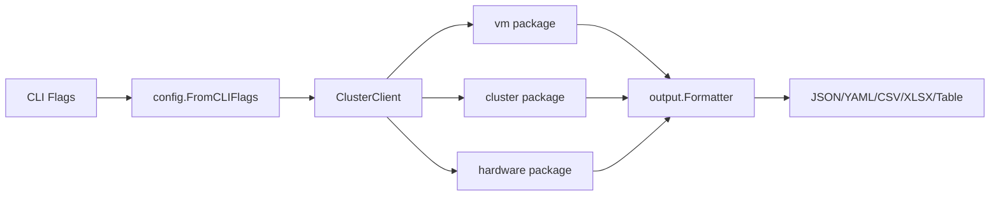
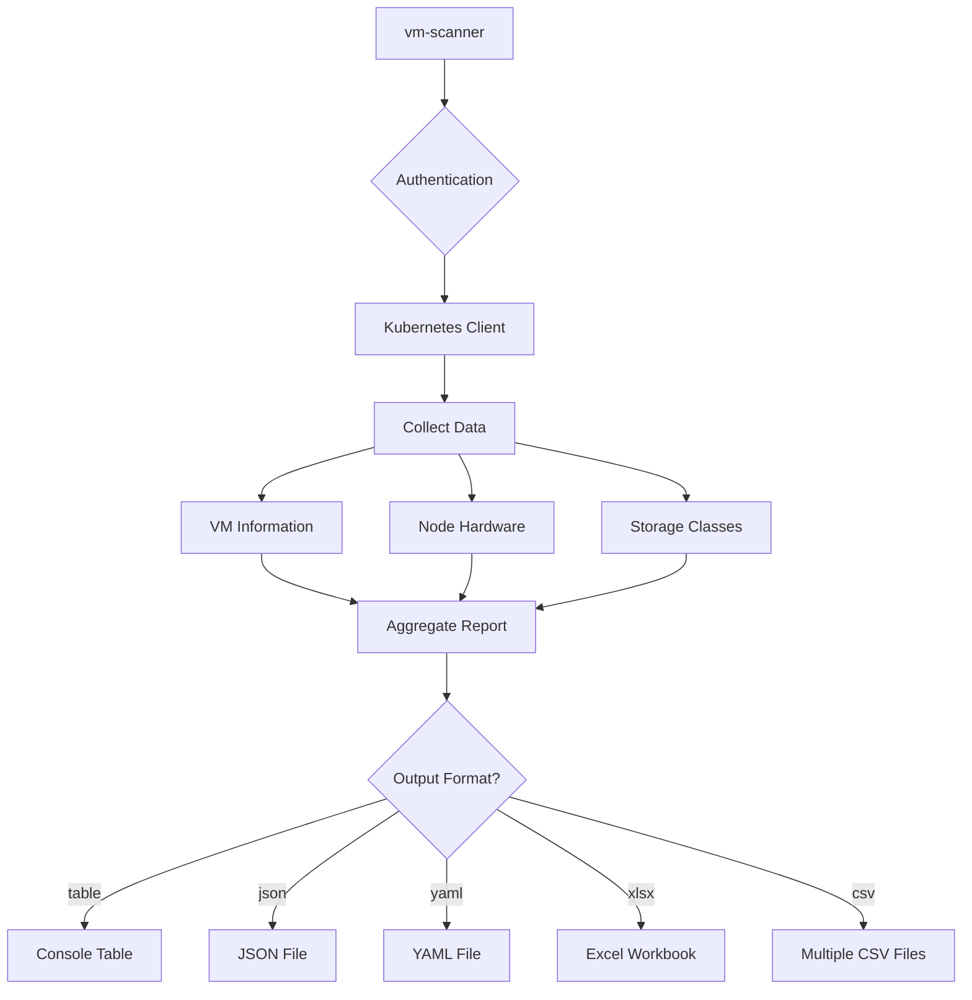

# VM Scanner -- Project Specification

## 1. Project Overview

vm-scanner is a Go CLI tool that extracts VirtualMachine inventory, node hardware, storage, and network data from OpenShift Virtualization / KubeVirt clusters and produces multi-sheet reports in XLSX, CSV, JSON, YAML, and table formats. It targets infrastructure teams performing migration planning, capacity analysis, and inventory audits who need automated, cross-resource correlation that the `oc` CLI cannot provide. The project is licensed under AGPL v3.0.

## 2. Problem Statement

- **RVTools only covers VMware**: No equivalent exists for Kubernetes/OpenShift Virtualization environments; teams manually correlate `oc` output across multiple commands.
- **Manual Excel work is error-prone**: Capacity planning and VM assessment require copying data into spreadsheets, where formulas and aggregations drift over time.
- **No cross-resource correlation**: `oc get vm` and `oc get vmi` produce siloed data; joining VM allocations to node capacity requires custom scripting.
- **No guest-agent-aware disk reporting**: No existing tool combines PVC-level allocation with guest-agent-reported filesystem usage for KubeVirt VMs.
- **Analysis is not automated**: Capacity planning (overcommit ratios) and VM assessment (memory waste flags, guest agent coverage) must be derived manually.

## 3. Functional Requirements

Each requirement is tagged: **Done**, **Partial**, or **Planned**.

- **FR-1: Cluster Authentication** -- Support kubeconfig file, bearer token, and in-cluster service account authentication. (Done)
- **FR-2: VM Inventory** -- List all VirtualMachines across all namespaces with metadata (name, namespace, UID, labels, annotations, creation time), power state, run strategy, eviction strategy, instance type, and preference. (Done)
- **FR-3: VM Resource Allocation** -- Extract CPU configuration (vCPUs, cores, sockets, threads, model), memory configuration (configured MiB, hot-plug max), and disk configuration (volume name, type, size, storage class) for every VM. (Done)
- **FR-4: VM Runtime Data** -- For running VMs, collect guest agent metadata: OS version, hostname, kernel version, timezone, guest agent version, running node, virt-launcher pod. Also collect runtime memory metrics (free, used, percentage) and guest disk usage. (Done)
- **FR-5: Node Hardware Collection** -- Collect per-node: CPU cores/model, memory capacity/used, filesystem capacity/used/available, OS version, kernel version, roles, schedulability, pod limits, storage capacity. (Done)
- **FR-6: Node Network Collection** -- Collect per-node: OVN bridge/interface IDs, IP addresses, MAC address, mode, next hops, host CIDRs, pod subnets, VLAN ID, NIC names/speeds/models via NMState/BMH/SR-IOV resolution. (Done)
- **FR-7: Storage Analysis** -- Collect storage class configuration (provisioner, reclaim policy, binding mode, expansion, default status). Per-VM PVC sizes and guest-agent filesystem usage. (Done)
- **FR-8: VM Network Interfaces** -- Per-VM: interface name, MAC address, IP addresses, type (masquerade/bridge/sriov), model (virtio/e1000e), network name, NetworkAttachmentDefinition name. (Partial -- type/model/NAD populated via `GetVMNetworkInterfaces()` in Phase 2; IP addresses from guest agent when VM is running)
- **FR-9: Comprehensive Report** -- Generate 8-sheet XLSX / 8-file CSV: Summary, Node Hardware, Virtual Machines, Storage Classes, VM Disks, Network Interfaces, Capacity Planning, VM Assessment. (Done)
- **FR-10: Multi-Format Output** -- Support table (stdout), JSON, YAML, single CSV, multi-CSV, and XLSX output formats with file export. (Done)
- **FR-11: Capacity Planning** -- Per-node CPU/memory overcommit ratios computed by joining VM resource requests against node capacity. (Done)
- **FR-12: VM Assessment** -- Per-VM health signals: guest agent status (Yes/No), memory utilization, memory waste flag (OVERSIZED when configured > 2x used), storage utilization, OS detection, run strategy. (Done)
- **FR-13: Metrics Collection** -- Node, pod, and VM runtime utilization metrics from metrics.k8s.io API. (Planned -- `pkg/software/` exists but is empty)
- **FR-14: Network Policy Analysis** -- Cluster network policies, ingress resources, service exposure. (Planned -- listed in README, not implemented)
- **FR-15: RBAC Provisioning** -- Programmatic creation of ClusterRole, ClusterRoleBinding, and ServiceAccount for the scanner. (Done -- `pkg/rbac/permissions.go`)

## 4. Non-Functional Requirements

- **NF-1: Least-Privilege RBAC** -- Tool requires only `get` and `list` verbs. ClusterRole name: `cluster-openshift-sv-tools`. API groups: `kubevirt.io`, core (`""`), `apps`, `storage.k8s.io`, `networking.k8s.io`, `nmstate.io`, `metal3.io`, `sriovnetwork.openshift.io`, `metrics.k8s.io`. Source: `pkg/rbac/permissions.go`.
- **NF-2: Output Parity** -- XLSX and CSV outputs must produce identical data for every shared column. Both formats are first-class outputs.
- **NF-3: Offline Development** -- Test fixtures in `testdata/` (VMs, VMIs, PVCs, raw API responses) allow development without a live cluster.
- **NF-4: Complexity Limits** -- No function exceeds 50 lines. Max cyclomatic complexity: 15. Average complexity target: under 5.
- **NF-5: Read-Only Cluster Access** -- The scanner never mutates cluster state. All API calls are `get` or `list`.

## 5. Architecture

### 5.1 Component Flow

### 5.2 Data Collection Pipeline

### 5.3 Pipeline Layers

| Layer | Description | Files |
|-------|-------------|-------|
| **Types** | Struct definitions for all data types | `pkg/*/types.go` |
| **Collection** | API calls and data gathering | `pkg/cluster/cluster.go`, `pkg/cluster/operators.go`, `pkg/cluster/inventory.go`, `pkg/vm/vm.go`, `pkg/hardware/*.go` |
| **Merge/Transform** | Joins runtime data to VM base info, builds `ComprehensiveReport` | `pkg/output/report_generator.go` |
| **Output** | Sheet writers and formatters | `pkg/output/formatter_xlsx.go`, `pkg/output/formatter_multi_csv.go`, helpers |
| **Tests** | Integration test assertions on report content | `pkg/output/*_test.go` |

## 6. Data Model Reference

### 6.1 VM Package (`pkg/vm/types.go`)

> Note: `CPUInfo` in the `vm` package is defined in `pkg/vm/cpu.go` (5 fields: CPUCores, CPUModel, CPUSockets, CPUThreads, VCPUs). The `hardware` package also has a `CPUInfo` with only 2 fields (CPUCores, CPUModel) for node-level CPU. Disambiguate by package prefix. `MemoryInfo` also exists in both packages -- `vm.MemoryInfo` has 7 fields for VM memory (configured/runtime), `hardware.MemoryInfo` has 3 fields for node memory.

- **`VMBaseInfo`** -- Base VM information always available from the VM definition. Fields: `Annotations` (`map[string]string`), `CreatedAt` (`metav1.Time`), `Labels` (`map[string]string`), `Name` (`string`), `Namespace` (`string`), `OwnerReferences` (`[]metav1.OwnerReference`), `Phase` (`string`), `Ready` (`bool`), `Running` (`bool`), `UID` (`string`), `UpdatedAt` (`metav1.Time`), `MachineType` (`string`), `OSName` (`string`), `RunStrategy` (`string`), `EvictionStrategy` (`string`), `InstanceType` (`string`), `Preference` (`string`), `CPUInfo` (`CPUInfo` from `pkg/vm/cpu.go`), `Disks` (`map[string]StorageInfo`), `MemoryInfo` (`vm.MemoryInfo`), `NetworkInterfaces` (`[]VMNetworkInfo`).

- **`VMRuntimeInfo`** -- Runtime-only data when VM is powered on. Fields: `CreationTimestamp` (`metav1.Time`), `PowerState` (`string`), `VMIUID` (`string`), `GuestMetadata` (`*GuestMetadata`).

- **`VMConsolidatedReport`** -- Embeds `VMBaseInfo` with optional `VMRuntimeInfo`. `Runtime` is `nil` when VM is stopped.

- **`VMDetails`** -- Embeds `VMBaseInfo` plus related resources. Fields: `Events` (`[]corev1.Event`), `Pods` (`[]corev1.Pod`), `PVCs` (`[]corev1.PersistentVolumeClaim`), `Runtime` (`*VMRuntimeInfo`), `Services` (`[]corev1.Service`).

- **`VMNetworkInfo`** -- Single VM network interface. Fields: `IPAddresses` (`[]string`), `MACAddress` (`string`), `Model` (`string`), `Name` (`string`), `Network` (`string`), `NetworkAttachmentDefinition` (`string`), `Type` (`string`).

- **`StorageInfo`** -- Single storage volume config and runtime. Fields: `SizeBytes` (`int64`), `SizeHuman` (`string`), `StorageClass` (`string`), `VolumeName` (`string`), `VolumeType` (`string`), `TotalStorage` (`int64`), `TotalStorageHuman` (`string`), `TotalStorageInUse` (`int64`), `TotalStorageInUseHuman` (`string`), `TotalStorageInUsePercentage` (`float64`).

- **`MemoryInfo`** (vm package) -- Memory allocation and usage. Fields: `MemoryConfiguredMiB` (`float64`), `MemoryHotPlugMax` (`float64`), `MemoryFree` (`float64`), `MemoryUsedByLibVirt` (`float64`), `MemoryUsedByVMI` (`float64`), `MemoryUsedPercentage` (`float64`), `TotalMemoryUsed` (`float64`).

- **`GuestMetadata`** -- Guest agent data reported from inside the VM. Fields: `DiskInfo` (`[]VMDiskInfo`), `GuestAgentVersion` (`string`), `HostName` (`string`), `KernelVersion` (`string`), `OSVersion` (`string`), `RunningOnNode` (`string`), `Timezone` (`string`), `VirtLauncherPod` (`string`).

- **`VMDiskInfo`** -- Guest-agent-reported disk info. Fields: `BusType` (`string`), `DiskName` (`string`), `FsType` (`string`), `MountPoint` (`string`), `TotalBytes` (`int64`), `UsedBytes` (`int64`).

- **`VMList`** -- Collection with summary counts. Fields: `Namespaces` (`[]string`), `RunningVMs` (`int`), `StoppedVMs` (`int`), `TotalVMs` (`int`), `VMs` (`[]VMConsolidatedReport`).

### 6.2 Hardware Package (`pkg/hardware/types.go`)

> `CPUInfo` and `MemoryInfo` here are node-level; the `vm` package has separate structs with the same names for VM-level data.

- **`CPUInfo`** (hardware) -- Node CPU info. Fields: `CPUCores` (`int64`), `CPUModel` (`string`).
- **`MemoryInfo`** (hardware) -- Node memory info. Fields: `MemoryCapacityGiB` (`float64`), `MemoryUsedGiB` (`float64`), `MemoryUsedPercentage` (`float64`).
- **`NICInfo`** -- Single physical network interface. Fields: `Duplex` (`string`), `IPAddress` (`string`), `MACAddress` (`string`), `Model` (`string`), `Name` (`string`), `SpeedMbps` (`int`), `State` (`string`).
- **`NetworkInfo`** -- Node network configuration. Fields: `BridgeID` (`string`), `HostCIDRs` (`[]string`), `InterfaceID` (`string`), `IPAddresses` (`[]string`), `MACAddress` (`string`), `Mode` (`string`), `NetworkInterfaces` (`[]NICInfo`), `NextHops` (`[]string`), `NodePortEnable` (`bool`), `PodNetworkSubnet` (`map[string][]string`), `VLANID` (`int`).
- **`StorageClassInfo`** -- Storage class configuration. Fields: `AllowVolumeExpansion` (`bool`), `AllowedTopologies` (`[]string`), `AllowedUnsafeToEvictVolumes` (`[]string`), `CreatedAt` (`metav1.Time`), `IsDefault` (`bool`), `MountOptions` (`[]string`), `Name` (`string`), `Parameters` (`map[string]string`), `Provisioner` (`string`), `ReclaimPolicy` (`string`), `VolumeBindingMode` (`string`).
- **`NodeFilesystemInfo`** -- Node filesystem usage (all values in GiB). Fields: `FilesystemAvailable` (`float64`), `FilesystemCapacity` (`float64`), `FilesystemUsed` (`float64`), `FilesystemUsagePercent` (`float64`).
- **`ClusterNetworkConfig`** -- Cluster-wide CNI configuration. Fields: `ClusterNetwork` (`[]string`), `ClusterNetworkMTU` (`int`), `ClusterNetworkType` (`string`), `ExternalIP` (`string`), `ServiceNetwork` (`[]string`).

### 6.3 Cluster Package (`pkg/cluster/types.go`)

- **`ClusterSummary`** -- Cluster-wide summary information. Fields: `CNIConfiguration` (`*CNIConfiguration`), `ClusterID` (`string`), `ClusterName` (`string`), `ClusterVersion` (`string`), `HasSchedulableControlPlane` (`bool`), `KubernetesVersion` (`string`), `KubeVirtVersion` (`*KubeVirtVersion`), `Operators` (`[]OperatorStatus`), `ProtectedNamespaces` (`int`), `Resources` (`*ClusterResources`), `RunningVMs` (`int`), `SchedulableControlPlaneCount` (`int`), `StoppedVMs` (`int`), `TotalNamespaces` (`int`), `TotalVMs` (`int`), `UserNamespaces` (`int`), `WorkerNodesCount` (`int`).
- **`ClusterNodeInfo`** -- Per-node hardware and network info. Fields: `ClusterNodeName` (`string`), `CoreOSVersion` (`string`), `CPU` (`hardware.CPUInfo`), `Filesystem` (`hardware.NodeFilesystemInfo`), `Memory` (`hardware.MemoryInfo`), `Network` (`hardware.NetworkInfo`), `NodeKernelVersion` (`string`), `NodePodLimits` (`int64`), `NodeRoles` (`[]string`), `NodeSchedulable` (`string`), `StorageCapacity` (`float64`).
- **`ClusterResources`** -- Aggregated cluster resource counts. Fields: `CPUUtilization` (`float64`), `MemoryUtilization` (`float64`), `StorageUtilization` (`float64`), `TotalCPU` (`int64`), `TotalMemoryGiB` (`float64`), `TotalLocalStorageGiB` (`float64`), `TotalLocalStorageUsedGiB` (`float64`), `TotalApplicationRequestedStorageGiB` (`int64`), `TotalApplicationUsedStorageGiB` (`int64`), `UsedCPU` (`int64`), `UsedMemoryGiB` (`float64`), `UsedStorageGiB` (`int64`).
- **`KubeVirtVersion`** -- KubeVirt operator version. Fields: `Deployed` (`string`), `Version` (`string`).
- **`OperatorStatus`** -- Single operator status. Fields: `CreatedAt` (`metav1.Time`), `Health` (`string`), `Labels` (`map[string]string`), `Name` (`string`), `Namespace` (`string`), `Status` (`string`), `Version` (`string`).

### 6.4 Output Package (`pkg/output/types.go`)

- **`ComprehensiveReport`** -- Top-level report container. Fields: `Cluster` (`*cluster.ClusterSummary`), `GeneratedAt` (`string`), `GeneratedBy` (`string`), `Nodes` (`[]cluster.ClusterNodeInfo`), `Storage` (`[]hardware.StorageClassInfo`), `Summary` (`*ReportSummary`), `VMs` (`[]vm.VMDetails`).
- **`ReportSummary`** -- Summary-level statistics. Fields: `ClusterSummary` (`*cluster.ClusterSummary`), `StorageClasses` (`int`).

## 7. API Surface

### 7.1 CLI Flags

All flags are defined in `pkg/config/config.go` `FromCLIFlags()`.

**Authentication:**
- `-auth-method` (default: `"kubeconfig"`) -- Authentication method: `"kubeconfig"`, `"in-cluster"`, or token-based
- `-kube-config` -- Full path to kubeconfig file (default: `""`)
- `-token` -- Bearer token for authentication (default: `""`)
- `-api-url` -- API URL for authentication (default: `""`)

**Operations:**
- `-test-connection` -- Test connectivity to the cluster
- `-kubevirt-version` -- Get KubeVirt version and operator status
- `-node-hardware-info` -- Get detailed node hardware information
- `-storage-classes` -- Get storage class information
- `-storage-volumes` -- Get storage volumes for all VMs
- `-vm-info` -- Get VirtualMachine information
- `-vm-inventory` -- Get consolidated VM inventory view
- `-test-all-outputs` -- Generate the full comprehensive report
- `-test-current-feat` -- Test the feature currently in development

**Output:**
- `-output-format` (default: `"stdout"`) -- Output format: `"stdout"`, `"json"`, `"yaml"`, `"csv"`, `"xlsx"` / `"excel"`
- `-output-file` -- Output file path for xlsx/csv/json/yaml formats (default: `""`)

### 7.2 Kubernetes APIs Consumed

**Core Kubernetes (`k8s.io/api/core/v1`):**
`pods`, `services`, `persistentvolumeclaims`, `persistentvolumes`, `events`, `nodes`, `namespaces`

**Node subresource:**
`nodes/status`

**KubeVirt (`kubevirt.io/api/core/v1`):**
`virtualmachines`, `virtualmachineinstances`, `datavolumes`, `virtualmachinesnapshots`

**Apps (`k8s.io/api/apps/v1`):**
`deployments`, `replicasets`

**Storage (`storage.k8s.io/v1`):**
`storageclasses`, `volumeattachments`

**Networking (`networking.k8s.io/v1`):**
`networkpolicies`, `ingresses`

**NIC Resolution:**
- `nmstate.io/v1` -- `nodenetworkstates`
- `metal3.io/v1` -- `baremetalhosts`
- `sriovnetwork.openshift.io/v1` -- `sriovnetworknodestates`

**Metrics (`metrics.k8s.io/v1beta1`):**
`nodes`, `pods`

### 7.3 RBAC Requirements

ClusterRole name: `cluster-openshift-sv-tools`. All verbs: `get`, `list` only. No mutations.

| API Group | Resources | Verbs |
|-----------|-----------|-------|
| `kubevirt.io` | `virtualmachines`, `virtualmachineinstances`, `datavolumes`, `virtualmachinesnapshots` | `get`, `list` |
| `""` (core) | `pods`, `services`, `persistentvolumeclaims`, `persistentvolumes`, `events`, `nodes`, `namespaces` | `get`, `list` |
| `""` (core) | `nodes/status` | `get`, `list` |
| `apps` | `deployments`, `replicasets` | `get`, `list` |
| `storage.k8s.io` | `storageclasses`, `volumeattachments` | `get`, `list` |
| `networking.k8s.io` | `networkpolicies`, `ingresses` | `get`, `list` |
| `nmstate.io` | `nodenetworkstates` | `get`, `list` |
| `metal3.io` | `baremetalhosts` | `get`, `list` |
| `sriovnetwork.openshift.io` | `sriovnetworknodestates` | `get`, `list` |
| `metrics.k8s.io` | `nodes`, `pods` | `get`, `list` |

## 8. Report Sheets Specification

The comprehensive report contains 8 sheets (XLSX tabs / CSV files). Column order is exact as produced by the source code. Computation formulas are included for all derived fields.

### 8.1 Summary

Not a columnar sheet -- a two-column key-value table.

- Cluster Name, Cluster ID, OpenShift Version, Kubernetes Version, KubeVirt Version, KubeVirt Deployed, Schedulable Control Plane Count, Control Plane Schedulable, Worker Nodes Count, (blank separator row), Total VMs, Running VMs, Stopped VMs, Total CPU, Total Memory (GiB), Used Memory (GiB), Total Local Storage (GiB), Total Application Requested Storage (GiB), Total Application Used Storage (GiB), Total Namespaces, User Created Namespaces, Nodes, Storage Classes, Guest Agent Coverage (%)
- Source: `ClusterSummary` fields for cluster info, `ClusterResources` for resource totals, `agentCount / RunningVMs * 100` for Guest Agent Coverage

### 8.2 Node Hardware

28 columns in this order:
1. Node Name
2. Node Roles
3. OS Version
4. Kernel Version
5. Schedulable
6. Storage Capacity
7. Pod Limits
8. CPU Cores
9. CPU Model
10. Filesystem Available (GB)
11. Filesystem Capacity (GB)
12. Filesystem Used (GB)
13. Filesystem Usage (%)
14. Memory Capacity (GiB)
15. Memory Used (GiB)
16. Memory Used (%)
17. Network Bridge ID
18. Network Interface ID
19. Network IP Addresses
20. Network MAC Address
21. Network Mode
22. Network Interfaces
23. Network Interface Speeds
24. Network Next Hops
25. Network Node Port Enable
26. Network VLAN ID
27. Network Host CIDRs
28. Network Pod Subnets
- Source: `ClusterNodeInfo` fields. Memory Used (%) = `node.Memory.MemoryUsedGiB / node.Memory.MemoryCapacityGiB * 100`

### 8.3 Virtual Machines

34 columns in this order:
1. Name
2. Namespace
3. Phase
4. Power State
5. Hostname
6. OS Name
7. OS Version
8. Running On Node
9. vCPUs Total
10. CPU Cores
11. CPU Sockets
12. CPU Threads
13. CPU Model
14. Configured Memory (MiB)
15. Memory Free (MiB)
16. Memory Used Total (MiB)
17. Memory Used (%)
18. Memory Used by LibVirt (MiB)
19. Memory Used by VMI (MiB)
20. Memory Hot Plug Max (MiB)
21. Disk Count
22. Guest Agent Version
23. Timezone
24. Virt Launcher Pod
25. UID
26. Created At
27. Creation Age (days)
28. Machine Type
29. Kernel Version
30. Run Strategy
31. Eviction Strategy
32. Instance Type
33. Preference
34. Labels
- Source: `VMDetails` / `VMBaseInfo` + `VMRuntimeInfo.GuestMetadata`. `CPUInfo` comes from `pkg/vm/cpu.go` (5 fields: CPUCores, CPUModel, CPUSockets, CPUThreads, VCPUs). Creation Age = `int(time.Since(CreatedAt).Hours() / 24)`. Labels = sorted `key=value;` pairs joined by `; `. UID uses VMI UID when running, otherwise VM UID.

### 8.4 Storage Classes

6 columns in this order:
1. Name
2. Provisioner
3. Reclaim Policy
4. Volume Binding Mode
5. Default
6. Allow Expansion
- Source: `StorageClassInfo` fields directly from `pkg/hardware/storage.go` collection

### 8.5 VM Disks

12 columns in this order:
1. VM Name
2. VM Namespace
3. Volume Name
4. Volume Type
5. PVC Size (GiB)
6. Storage Class
7. Guest Mount Point
8. Guest FS Type
9. Guest Total (GiB)
10. Guest Used (GiB)
11. Guest Free (GiB)
12. Guest Usage (%)
- Source: Two row types per VM. PVC rows from `VMDetails.Disks` map: PVC Size = `float64(disk.SizeBytes) / (1024*1024*1024)`. Guest-agent rows from `VMDetails.Runtime.GuestMetadata.DiskInfo`: Volume Type = `"guest-agent"`, Guest Usage = `float64(UsedBytes) / float64(TotalBytes) * 100`. Guest Free = Guest Total - Guest Used. Empty columns for PVC rows: Guest Mount Point, Guest FS Type.

### 8.6 Network Interfaces

9 columns in this order:
1. VM Name
2. VM Namespace
3. Interface Name
4. MAC Address
5. IP Addresses
6. Type
7. Model
8. Network Name
9. NAD Name
- Source: `VMDetails.NetworkInterfaces` slice. IP Addresses = comma-joined `netIf.IPAddresses` slice. Type/Model/NAD populated via `GetVMNetworkInterfaces()` (Phase 2); may be empty for stopped VMs.

### 8.7 Capacity Planning

10 columns in this order:
1. Node Name
2. CPU Cores
3. CPU Allocated to VMs
4. CPU Overcommit Ratio
5. Memory Capacity (GiB)
6. Memory Allocated to VMs (GiB)
7. Memory Overcommit Ratio
8. VM Count
9. Filesystem Used (%)
10. Memory Used (%)
- Source: Join `ClusterNodeInfo` with `VMDetails` on `GuestMetadata.RunningOnNode == ClusterNodeName`. CPU Allocated = `sum(vm.CPUInfo.VCPUs for vm in nodeVMs)`. Memory Allocated = `sum(vm.MemoryInfo.MemoryConfiguredMiB / 1024 for vm in nodeVMs)`. CPU Ratio = `float64(cpuAllocated) / float64(node.CPU.CPUCores)`. Memory Ratio = `memAllocatedGiB / node.Memory.MemoryCapacityGiB`. Ratios formatted as `X.X:1` string.

### 8.8 VM Assessment

15 columns in this order:
1. VM Name
2. Namespace
3. Power State
4. Guest Agent
5. Memory Configured (MiB)
6. Memory Used (MiB)
7. Memory Utilization (%)
8. Memory Waste Flag
9. vCPUs
10. Disk Count
11. Total Disk Allocated (GiB)
12. Total Disk Used (GiB)
13. Storage Utilization (%)
14. OS Detected
15. Run Strategy
- Source: `VMDetails` fields. Guest Agent = `"Yes"` if `GuestMetadata.GuestAgentVersion != ""` else `"No"`. Memory Waste Flag = `"OVERSIZED"` if `MemoryConfiguredMiB > 2 * TotalMemoryUsed` and both > 0. Total Disk Allocated = `sum(disk.SizeBytes / (1024*1024*1024) for disk in vm.Disks)`. Storage Utilization = `TotalDiskUsed / TotalDiskAllocated * 100`. OS Detected = `OSName` falling back to `GuestMetadata.OSVersion`.

## 9. Current State and Known Gaps

### 9.1 Completed Work

- **Phase 1 (report expansion)**: Report grew from 4 to 8 sheets. All sheet writers, helpers, and integration tests implemented and verified against the live cluster. Documented in `CHANGES_phase1.md`.
- **Phase 2 (network enrichment)**: `GetVMNetworkInterfaces()` extracts type/model/NAD from VM spec. `nic_resolver.go` resolves NIC speed/model from NMState, BMH, SR-IOV. `enrichBaseInfoFromVM()` populates RunStrategy, EvictionStrategy, InstanceType, Preference on `VMBaseInfo`. Documented in `CHANGES_phase2.md`.
- **Output package refactoring**: Single 2,724-line formatter file split into 12 focused files. Average cyclomatic complexity: 3.46. Max complexity: 17. Documented in `REFACTORING_GUIDE.md`.
- **RBAC provisioning**: `pkg/rbac/permissions.go` provides programmatic creation of ClusterRole, ClusterRoleBinding, and ServiceAccount.
- **Core collection**: VM inventory, cluster data, storage analysis, node hardware all functional with live-cluster verification.

### 9.2 In-Progress Work

- **Phase 2 network interface population**: `GetVMNetworkInterfaces()` is implemented and wired into `VMDetails.NetworkInterfaces`, but IP address population from the guest agent depends on the VMI being running. Some fields may be empty for stopped VMs. NIC resolver fallback chain (NMState -> BMH -> SR-IOV -> node stats) implemented but not yet tested against all cluster types.

### 9.3 Known Gaps

- `pkg/software/` -- empty package; no software inventory collection (FR-13 not started)
- `vm-scanner/docs/` -- empty directory; no additional architecture docs
- **Metrics collection (FR-13)** -- no implementation; `metrics.k8s.io` API surface is defined in RBAC but not called
- **Network policy analysis (FR-14)** -- RBAC allows `networking.k8s.io/networkpolicies` and `ingresses` but no collection code exists
- **No container image or Helm chart** -- no in-cluster deployment method; scanner runs as a standalone binary
- **No diff/delta reporting** -- reports represent a point-in-time snapshot; no mechanism to compare two reports
- **Test coverage** -- integration tests (`comprehensive_report_test.go`) validate structure and content for the comprehensive report; no unit tests for individual parsers using `testdata/` fixtures
- **Stale buddy todos** -- external todo tracking predates current implementation; many P1/P2 items are already done; not authoritative

## 10. Roadmap

1. Complete Phase 2 network testing and verification against live cluster across BMH, NMState, and SR-IOV node types
2. Metrics collection (FR-13) -- implement node and pod utilization metrics via `metrics.k8s.io` API; add as new columns/sheet
3. Unit tests -- add table-driven unit tests for VM, hardware, and cluster parsers using `testdata/` fixtures
4. Network policy analysis (FR-14) -- implement collection of `networkpolicies` and `ingresses`; add as a new report section
5. Container image + Helm chart -- package vm-scanner for in-cluster deployment as a Job or CronJob
6. Diff/delta reporting -- implement comparison of two `ComprehensiveReport` snapshots (added/removed VMs, changed capacities)
7. Software inventory via guest agent -- populate `pkg/software/` package to query installed packages/OS info from `GuestMetadata`