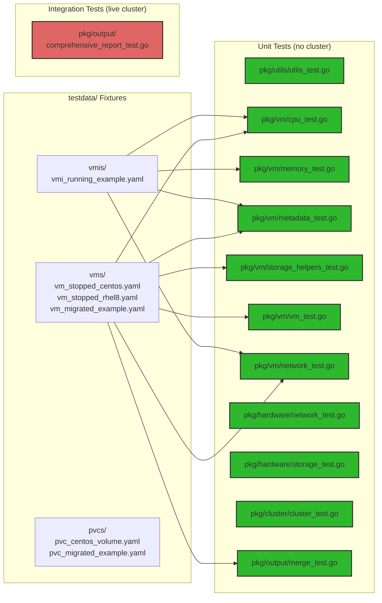

# VM Scanner Test Suite

This document explains every test in the project, what production code it exercises, how to run it, and how much confidence it provides. It is written for a Python developer with pytest experience who is new to Go testing.

---

## 1. Quick Reference

| File | Package | Build Tag | Test Functions | What It Tests |
|---|---|---|---|---|
| `pkg/utils/utils_test.go` | `utils` | none | 8 | ParseQuantityToBytes, BytesToMiB/GiB, QuantityToMiB/GiB, BuildPath, InterfaceSliceToStringSlice, RoundToOneDecimal |
| `pkg/vm/testhelpers_test.go` | `vm` | none | 0 (helper only) | Shared `loadFixture` helper for all `pkg/vm/` tests |
| `pkg/vm/cpu_test.go` | `vm` | none | 3 | GetCPUInfo, GetCPUInfoFromVM, GetCPUInfoFromVMI |
| `pkg/vm/memory_test.go` | `vm` | none | 3 | parseMetricValue, ParseMemoryFromMonitoring, GetMemoryHotPlugMax |
| `pkg/vm/metadata_test.go` | `vm` | none | 3 | ParseVMIMachineInfo, ParseVMMachineInfo, parseGuestMetadataFromGuestAgentInfo |
| `pkg/vm/storage_helpers_test.go` | `vm` | none | 3 | getPVCList, sumTotalStorage, parseStorageInfoFromGuestAgentInfo |
| `pkg/vm/vm_test.go` | `vm` | none | 3 | VMKey, convertNetworkMapToSlice, fixture integrity via GetCPUInfoFromVM |
| `pkg/vm/network_test.go` | `vm` | none | 9 | Full network extraction pipeline (table-driven + fixture integration) |
| `pkg/hardware/network_test.go` | `hardware` | none | 5 | isPhysicalInterface, isHexString, filterPhysicalInterfaces, ParsePhysicalInterfaceNames, parseLinkSpeedString |
| `pkg/hardware/storage_test.go` | `hardware` | none | 1 | ParseFileSystemStats |
| `pkg/cluster/cluster_test.go` | `cluster` | none | 4 | GetClusterTopology, CalculateClusterResources, CalculateVMStorageTotals, SortNamespaces |
| `pkg/output/merge_test.go` | `output` | none | 3 | extractVMPhase, mergeGuestAgentDiskUsage, enrichBaseInfoFromVM |
| `pkg/output/comprehensive_report_test.go` | `output` | `integration` | 8 | Full report generation and XLSX/CSV output structure |

**Total: 45 top-level test functions, 192 subtests across 5 packages.**

---

## 2. How to Run the Tests

### Unit tests (no cluster required)

```bash
go test ./...                  # run all unit tests
go test -v ./...               # verbose output
go test -v -run TestName ./... # run tests matching "TestName"
go test -coverprofile=cover.out ./... && go tool cover -html=cover.out  # with coverage
```

### Integration tests (requires live OpenShift cluster)

```bash
go test -tags=integration -v -kubeconfig=/path/to/kubeconfig ./pkg/output/
```

The `-kubeconfig` flag is required. If omitted, integration tests skip automatically.

---

### Go Testing Concepts for Python Developers

| Go Concept | Python Equivalent | What It Does |
|---|---|---|
| `go test` | `pytest` | Runs all `*_test.go` files |
| `-run TestName` | `pytest -k "TestName"` | Filter tests by name pattern |
| `-v` | `-v` | Verbose output with full test names |
| `t.Run("subtest", func(t *testing.T))` | `@pytest.mark.parametrize` | Each sub-case is a separate pass/fail with its own name |
| `t.Helper()` | `__tracebackhide__ = True` | Marks a helper function; its stack frame is hidden from error output |
| `t.Fatal()` | `pytest.fail()` (stops immediately) | Stops the current test on the first failure |
| `t.Error()` | `pytest.warns` or collecting assertion | Records a failure but the test continues |
| `t.Skip()` | `pytest.skip()` | Skips the current test |
| `//go:build integration` | `@pytest.mark.slow` (build-gated) | Excludes the test from normal `go test`; only runs with `-tags=integration` |
| `TestMain(m *testing.M)` | `conftest.py` session fixture | Runs once before any `Test*` functions in the package |
| `testdata/` directory | `tests/fixtures/` | Go convention: ignored during builds, used for raw test data |

---

## 3. Test Architecture Overview



---

## 4. Test File Deep Dives

### 4.0 `pkg/utils/utils_test.go`

**Production functions tested:** `ParseQuantityToBytes`, `BytesToMiB`, `BytesToGiB`, `QuantityToMiB`, `QuantityToGiB`, `BuildPath`, `InterfaceSliceToStringSlice`, `RoundToOneDecimal`

All tests are table-driven. Covers: valid inputs, boundary values (0, empty strings), error cases (invalid quantity strings), type coercion (non-string items in interface slices), and float rounding behavior including negative values.

---

### 4.1 `pkg/vm/vm_test.go`

**Production functions tested:** `VMKey`, `convertNetworkMapToSlice`, `GetCPUInfoFromVM`

- `TestVMKey` -- 3 cases: standard, empty namespace, empty name
- `TestConvertNetworkMapToSlice` -- 3 cases: two entries, empty map, nil map
- `TestFixtureIntegrity` -- loads 3 VM fixtures and calls `GetCPUInfoFromVM` on each, asserting correct behavior (rhel8 has CPU data, centos returns empty CPUInfo, migrated returns no error)

---

### 4.2 `pkg/vm/network_test.go`

**Production functions tested:** `interfaceTypeFromMap`, `modelFromInterface`, `buildNetworkToNADMap`, `enrichInterfaceFromSpec`, `ReturnNetworkInterfaceMap`, `GetVMNetworkInterfaces`, `GetNetworkInterfaces`

Table-driven tests (consolidated from original individual tests):
- `TestInterfaceTypeFromMap` -- 5 cases (bridge, masquerade, sriov, slirp, no type)
- `TestModelFromInterface` -- 4 cases (plain string, nested object, empty, nil)
- `TestBuildNetworkToNADMap` -- 5 cases (pod, multus, mixed, empty, non-map)
- `TestEnrichInterfaceFromSpec` -- 3 cases (bridge+pod, masquerade+multus, fallback to name)

Fixture integration tests:
- `TestReturnNetworkInterfaceMap_StoppedVM_Centos` / `_RHEL8` -- stopped VM NIC extraction
- `TestReturnNetworkInterfaceMap_MultusBridge` -- migrated VM with Multus `default/test-vlan`, asserts bridge type, virtio model, correct NAD and MAC
- `TestGetVMNetworkInterfaces_RunningVMI` -- VMI path with status MAC/IP merge
- `TestGetNetworkInterfaces_VM_Path` -- top-level VM dispatcher

---

### 4.3 `pkg/vm/cpu_test.go`

**Production functions tested:** `GetCPUInfo`, `GetCPUInfoFromVM`, `GetCPUInfoFromVMI`

- `TestGetCPUInfo` -- 3 fixture cases: rhel8 (cores=1, sockets=2, threads=1, vCPUs=2, model=host-model), centos (no CPU block -> empty), migrated (partial CPU -> empty)
- `TestGetCPUInfoFromVM` -- rhel8 fixture through VM wrapper
- `TestGetCPUInfoFromVMI` -- VMI fixture (cores=2, sockets=1, threads=1, vCPUs=2)

---

### 4.4 `pkg/vm/memory_test.go`

**Production functions tested:** `parseMetricValue`, `ParseMemoryFromMonitoring`, `GetMemoryHotPlugMax`

- `TestParseMetricValue` -- 4 cases: normal metric line, no space, non-numeric, empty
- `TestParseMemoryFromMonitoring` -- 4 cases: valid metrics (checks usedMiB/freeMiB via BytesToMiB), wrong VMI name, empty, comments only
- `TestGetMemoryHotPlugMax` -- 2 cases: constructed unstructured with maxGuest=16Gi (16384 MiB), missing maxGuest (error)

---

### 4.5 `pkg/vm/metadata_test.go`

**Production functions tested:** `ParseVMIMachineInfo`, `ParseVMMachineInfo`, `parseGuestMetadataFromGuestAgentInfo`

- `TestParseVMIMachineInfo` -- VMI fixture: prettyName, node, version
- `TestParseVMMachineInfo` -- 2 fixtures: rhel8 has OS annotation, migrated does not
- `TestParseGuestMetadataFromGuestAgentInfo` -- 4 cases: valid JSON with timezone split, without timezone, invalid JSON (error), empty (error)

---

### 4.6 `pkg/vm/storage_helpers_test.go`

**Production functions tested:** `getPVCList`, `sumTotalStorage`, `parseStorageInfoFromGuestAgentInfo`

- `TestGetPVCList` -- migrated fixture (2 PVCs), empty spec (false, nil)
- `TestSumTotalStorage` -- two items, empty, single GiB
- `TestParseStorageInfoFromGuestAgentInfo` -- valid fsInfo JSON, empty string (nil), invalid JSON (error)

---

### 4.7 `pkg/hardware/network_test.go`

**Production functions tested:** `isPhysicalInterface`, `isHexString`, `filterPhysicalInterfaces`, `ParsePhysicalInterfaceNames`, `parseLinkSpeedString`

- `TestIsPhysicalInterface` -- 17 cases: 8 physical (enp, eno, ens, eth0, br-, wlp, wlan, br-ex), 6 virtual (veth, ovs, lo, docker, cni, ovn), hex container ID, short non-physical, eth without digits
- `TestIsHexString` -- 6 cases including empty string (vacuously true)
- `TestFilterPhysicalInterfaces` -- mixed list, empty
- `TestParsePhysicalInterfaceNames` -- valid JSON, invalid JSON, empty interfaces
- `TestParseLinkSpeedString` -- Mb/s parsing, documents that Gb/s is NOT parsed (returns 0)

---

### 4.8 `pkg/hardware/storage_test.go`

**Production functions tested:** `ParseFileSystemStats`

- `TestParseFileSystemStats` -- 4 cases: valid JSON (500GiB/1000GiB = 50%), missing node, missing fs, invalid JSON

---

### 4.9 `pkg/cluster/cluster_test.go`

**Production functions tested:** `GetClusterTopology`, `CalculateClusterResources`, `CalculateVMStorageTotals`, `SortNamespaces`

- `TestGetClusterTopology` -- 5 cases: 3 schedulable CP + 3 workers, 3 non-schedulable CP (returns 0,0), mixed, empty, dual-role node. Documents the behavior where non-schedulable CP zeroes out all counts.
- `TestCalculateClusterResources` -- 3 cases: two nodes, empty, fractional rounding
- `TestCalculateVMStorageTotals` -- 3 cases: two VMs (40GiB/15GiB), empty disks, truncation (1 byte less than 1 GiB -> 0)
- `TestSortNamespaces` -- 3 cases: mix, all protected, empty

---

### 4.10 `pkg/output/merge_test.go`

**Production functions tested:** `extractVMPhase`, `mergeGuestAgentDiskUsage`, `enrichBaseInfoFromVM`

- `TestExtractVMPhase` -- 3 cases: Running, no status (Unknown), Stopped
- `TestMergeGuestAgentDiskUsage` -- 5 cases: empty diskInfo (unchanged), single disk (10%), multiple disks (summed to 15%), zero TotalStorage (no divide-by-zero), empty disksMap
- `TestEnrichBaseInfoFromVM` -- 4 cases using fixtures + constructed objects: centos (instancetype=u1.xlarge, preference=centos.stream9), rhel8 (no instancetype, runStrategy=RerunOnFailure), nil Object (no panic), wrong instancetype kind (stays empty)

---

### 4.11 `pkg/output/comprehensive_report_test.go`

**Build tag:** `//go:build integration` -- excluded from `go test ./...`

**Production functions tested:** `GenerateComprehensiveReport`, XLSX and CSV formatters

Report is generated once via `sync.Once` and cached (analogous to `@pytest.fixture(scope="module")`). All 8 tests inspect the cached report.

| Test Function | What It Checks |
|---|---|
| `TestComprehensiveReport_GeneratesSuccessfully` | Report non-nil, metadata, VM counts |
| `TestComprehensiveReport_XLSXOutput` | 8 sheets exist with correct names and at least 1 row |
| `TestComprehensiveReport_VMDisksSheet` | Headers, non-empty VM names |
| `TestComprehensiveReport_NetworkInterfacesSheet` | Headers, non-empty VM names |
| `TestComprehensiveReport_CapacityPlanningSheet` | Headers, row count == node count |
| `TestComprehensiveReport_VMAssessmentSheet` | Headers, Guest Agent Yes/No, Memory Waste Flag |
| `TestComprehensiveReport_CSVOutput` | 8 CSV files exist with >= 2 rows |
| `TestComprehensiveReport_VMTabPhase2Columns` | Phase 2 columns have non-empty values |

---

## 5. Test Fixtures (`testdata/`)

| File | Description | Used By |
|---|---|---|
| `vms/vm_stopped_centos.yaml` | CentOS Stream 9 VM, instancetype + preference, DataVolume templates | cpu, metadata, network, vm, merge tests |
| `vms/vm_stopped_rhel8.yaml` | RHEL 8 VM, explicit CPU/memory, masquerade NIC with virtio | cpu, metadata, network, vm, merge tests |
| `vms/vm_migrated_example.yaml` | Migrated VM, bridge + Multus `default/test-vlan`, PVC-backed | cpu, storage, network (Multus test), vm tests |
| `vmis/vmi_running_example.yaml` | Running VMI, guest OS info, phase=Running, node=test-node-01 | cpu, memory, metadata, network tests |
| `pvcs/pvc_centos_volume.yaml` | CentOS root volume PVC | (available for future tests) |
| `pvcs/pvc_migrated_example.yaml` | Migrated PVC, 43Gi, Forklift labels | (available for future tests) |

---

## 6. Confidence Assessment

| Area | Confidence | Why |
|---|---|---|
| Utility functions (quantity parsing, rounding, path building) | **High** | All 8 functions tested with edge cases and error paths |
| CPU info extraction | **High** | 3 fixtures, all wrapper functions tested, default model fallback verified |
| Memory metric parsing | **High** | Prometheus text parser + hot plug max tested with constructed data |
| Metadata extraction (guest agent, OS info) | **High** | JSON parsing, timezone split, fixture validation |
| Storage helpers (PVC list, total, guest agent disk info) | **High** | Fixture + constructed JSON tests |
| Network interface extraction | **High** | Table-driven helpers + fixture pipeline + Multus test |
| Hardware NIC classification | **High** | 17 interface names tested, hex detection, link speed parsing |
| Hardware filesystem stats | **High** | Valid + error cases, float precision |
| Cluster topology and resource calculation | **High** | Worker count behavior documented, rounding, truncation |
| Report merge logic (enrichBaseInfoFromVM, mergeGuestAgentDiskUsage) | **High** | Fixture + constructed data, divide-by-zero, nil safety |
| XLSX report structure (sheets, headers, row counts) | **Medium** | Headers validated; computed values not checked |
| CSV report existence | **Low** | Files verified to exist; content not compared to XLSX |

---

## 7. Glossary of Go Testing Concepts

`testing.T` -- the test context object passed to every `Test*` function. Analogous to `pytest` receiving a fixture.

`TestMain` -- runs before any `Test*` functions in a package. Used for `flag.Parse()`, shared setup, and `os.Exit(m.Run())`. Like a `conftest.py` session-scoped fixture.

`t.Run(name, func(t *testing.T))` -- creates a named subtest. Each subtest is an independent pass/fail. Like `@pytest.mark.parametrize`.

`t.Fatal(args)` -- stops the test immediately. Like `pytest.fail()`.

`t.Error(args)` -- records a failure but continues. Like a soft assertion.

`t.Helper()` -- hides the helper's stack frame from error output. Like `__tracebackhide__ = True`.

`//go:build integration` -- build constraint excluding the file from normal `go test`. Like `@pytest.mark.slow`.

`sync.Once` -- ensures a function runs exactly once. Used to cache the integration test report.

`unstructured.Unstructured` -- holds any Kubernetes object as `map[string]interface{}`. Like loading YAML into a Python `dict`.

`testdata/` -- Go convention for test fixtures, ignored by the compiler.
